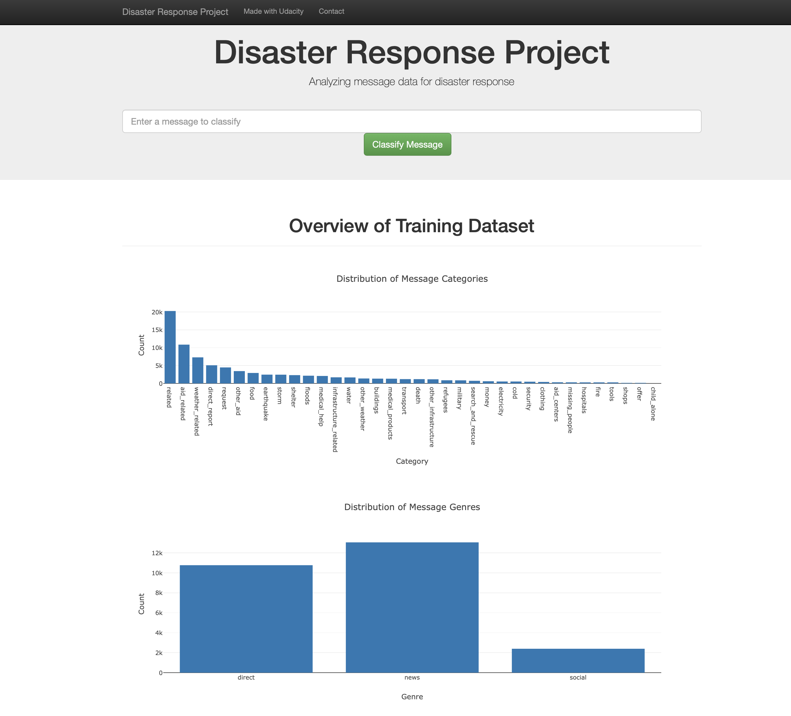

# Disaster Response Pipeline Project

During and immediately after natural disaster, lot of communications come to to disaster response organizations either through direct messages or through social media channels. Filtering through these communications and pulling out  important requests for medical aid, water, logistics etc is a laborious and time critical task. 

In this project, we explore a machine learned model to power the message classification and provide a web interface for entering messages and identifying the aids needed. 

### Three Components

There are three components in this project, an ETL pipeline to process the raw communication text, a ML pipleline to train a model, and a web application utilizing the trained model for message classfication. 

### Instructions

1. Install Python dependencies.
```
$ pip install -r requirements.txt
```

2. Run the following commands in the project's root directory for ETL and ML pipeline.

    - To run ETL pipeline that cleans data and stores into a sqllite database file
        
        ```
        $ python data/process_data.py data/disaster_messages.csv data/disaster_categories.csv data/disaster-response.db
        ```

    - To run ML pipeline that trains classifier and saves model
        ```
        $ python models/train_classifier.py data/disaster-response.db models/disaster-response.pkl
        ```

3. Run the following command in the app's directory to run your web app.

    ```
    $ python run.py
    ```

4. Go to http://0.0.0.0:3001/, type in a message and see the classification result!


Project Organization
------------
    ├── app           
    │   └── templates  
    │       └── go.html <- html template file to render message classification result
    │       └── master.html <- html template file to render main page
    │   └── custom_transformer.py <- custom transformer module for model file unpickling 
    │   └── run.py <- flask app module
    │   └── visualization.py <- module to generate plotly objects
    │
    ├── data           
    │   └── disaster_categories.csv <- raw data file for disaster categories
    │   └── disaster_messages.csv <- raw data file for disaster messages
    │   └── disaster-response.db <- sqlite file for cleaned data
    │   └── ETL Pipeline Preparation.ipynb <- Jupyter notebook for ETL pipeline exploration
    │   └── process_data.py <- ETL data pipeline code
    │
    ├── images
    │   └── web_ui.png <- image file for Readme.MD visual  
    │
    ├── models 
    │   └── custom_transformer.py <- custom transformer to identify whether a sentence starts with a verb 
    │   └── ML Pipeline Preparation.ipynb <- Jupyter notebook for ML pipeline experiment
    │   └── train_classifier.py <- feature extraction and model training pipeline code       
    │
    ├── README.md          <- The top-level README for developers using this project.
    └── requirements.txt   <- The requirements file for reproducing the analysis environment, e.g.
                              generated with `pip freeze > requirements.txt`
    

### Data Processing and Modeling

See detailed and results at [here](https://github.com/Juliaj/udacity-data-scientist/blob/gh-pages/disaster-response.md)

### Acknowledgement 
The training data in this project are disaster data from [Figure Eight](https://www.figure-eight.com/). It is made available by Udacity [Data Scientist Nanodegree program](https://classroom.udacity.com/nanodegrees/nd025). 
