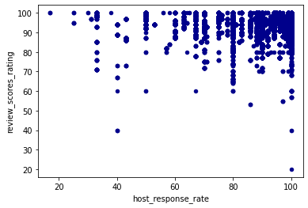

## Eyeing the Airbnb Market in Seattle and Boston

I've always been in tech industry and never explored any other career paths. When I have had a chance to look at the year 2016 data from Airbnb lately, I realized that you could make a living and a good fortune from Airbnb rentals. I've traveled many places all over the world, Seattle and Boston are two of my most favorite cities. Here, I am going to relive as an Airbnb property owner wearing a data scientist hat to examine the market in these two cities back in time.  


https://unsplash.com/photos/NngNVT74o6s?utm_source=unsplash&utm_medium=referral&utm_content=creditShareLink

### Markets and Trends

Both Boston and Seattle are great metropolitan areas. One has lot of history and the other has more natural beauty. Lot of travelers and outsiders come to the cities to stay in Airbnb for a visit or to work. We look at four questions to understand these rental markets.

#### where are the hottest neighourboods for rentals?

The `Captical Hill` in Seattle had almost twice of listings than the number two neighourhood `Ballard`. The listings from Boston were more linearly distributed among the top 10 neighourhoods. 


In both cities, the top 10 neighbourhoods count for ~50% of the listings. Specically, Seattle top 10 counts for 45.81% of listings. In Boston, top 10 counts for 65.91%, a larger percentage.

#### What is the trend from room type perspective? 

In both cities, the availability of entire home/apartment is comparable. For private room, Boston has more. 


It isn't surprising to see that the shared room has the smallest share of the market. 

#### Are expensive rentals available all year long?

In both cities, some rentals were really expensive. Were there a market for those properties? Looking at the rentals with price point above 99 percentile, in Seattle, the price point was above $550.0 verus in Boston, the price point was above $725.0.


Based on data, good portion of these luxuary properties were indeed long term and available all year long. This begs a question, is there any advantage of renting them through Airbnb versus renting them via local property management company? 

#### How responsive did an owner need to be in order to get good review ratings?

As a rental owner, do you need to make yourself always available, i.e. high host response rate to get a better review ratings? It turned out, not necessarily. 



The chart shows that more reviews were submitted when response rate were higher. However higher rate review score could be achived with hands-off.

### Rental Price Prediction

There are many factors could affect the property value and its rental price. For modeling, data from Seattle and Boston were combined to create a larger set. Ten fields, 'zipcode', 'property_type', 'room_type', 'accommodates', 'bathrooms', 'bedrooms', 'beds', 'review_scores_value', 'amenities_count' and 'price' were chosen to model the rental price:  

- Most of the data preparation follows standard procedure such as imputing missing data with mean, one hot encoding for categorical data etc.
- For `property_type`, encoding was done with two different options. One is to create a hash with a bucket size. The hashing is to address the general problems associated with categorical features: incomplete vocabulary, model size due to cardinality, and cold start. The other is one hot encoding.

The models trained are linear regression models. There was no significant difference in r2 score for both encoding approaches. 

1. with hashed features: train_score: `0.367`, test_score: `0.363`.
2. with no feature hashing: train_score: `0.370`, test_score: `0.359`.

The low r2 scores could be due to the limitted data, or the initial section of the features and warrants futher investigation and improvement. 

During experiment, one benefit of using one hot encoding with `property_type` is that it has better visibility of feature weights.  

```
est_int	coefs	abs_coefs
25	property_type_Villa	160.049357	160.049357
16	property_type_Dorm	-97.613705	97.613705
10	property_type_Boat	84.528542	84.528542
8	room_type_Shared room	-74.476788	74.476788
7	room_type_Private room	-68.737470	68.737470
17	property_type_Entire Floor	-63.951214	63.951214
18	property_type_Guesthouse	56.681691	56.681691
24	property_type_Treehouse	37.065507	37.065507
3	bedrooms	34.050519	34.050519
2	bathrooms	28.618914	28.618914
22	property_type_Tent	-18.914358	18.914358
21	property_type_Other	15.548284	15.548284
9	property_type_Bed & Breakfast	15.531105	15.531105
13	property_type_Camper/RV	14.354585	14.354585
19	property_type_House	-13.887032	13.887032
14	property_type_Chalet	11.561077	11.561077
12	property_type_Cabin	-10.930670	10.930670
20	property_type_Loft	8.800867	8.800867
1	accommodates	8.074085	8.074085
23	property_type_Townhouse	-7.567396	7.567396
15	property_type_Condominium	3.618863	3.618863
11	property_type_Bungalow	2.761789	2.761789
6	amenities_count	0.771951	0.771951
5	review_scores_value	0.271661	0.271661
4	beds	-0.208683	0.208683
0	zipcode	-0.000528	0.000528
26	property_type_Yurt	0.000000	0.000000
```
This list shows `propert types` have larger coefficient overall. Different than houses and properties, `zipcode` or **location** has little influence to the price of Airbnb rentals.

Phew, that was fun!


