# Starbucks Capstone Challenge: Offer Response Prediction

A project for [Udacity Data Science Nanodegree program.](https://classroom.udacity.com/nanodegrees/nd025/dashboard/overview)


Photo by <a href="https://unsplash.com/@guilhermestecanella?utm_source=unsplash&utm_medium=referral&utm_content=creditCopyText">Guilherme Stecanella</a> on <a href="https://unsplash.com/s/photos/starbucks?utm_source=unsplash&utm_medium=referral&utm_content=creditCopyText">Unsplash</a>
  
 
  
## Project overview

With over 30,000 cafes across the globe, Starbucks has become more than just a household name. From its iconic cups to the espresso inside them, Starbucks has catapulted from one coffee bean shop in Seattle to a sprawling coporate giant over the last 50 years. [Starbucks Isn’t a Coffee Business — It’s a Data Tech Company.](https://marker.medium.com/starbucks-isnt-a-coffee-company-its-a-data-technology-business-ddd9b397d83e) 

Starbucks often engages customers by sending them various offers, sometimes informational, sometimes it's a discount offer or Buy One Get One Free (BOGO). With its large customer base, how do we know which demographic groups respond best to which offer type? How do we know whether the offers actually improve company's bottom line?
 
These are the basis of this project. In the sections below, we're going to use techniques from data science to analyze customer's interactions with these offers, then use machine learning to learn a classifier to predict customer's reponses. 

## Problem Statement

From the three simulated datasets provided, we have 10 different offers and with varying level of responses from customers. There are many areas that we can explore. For this project, the question we are focusing is: given customers' demgraphic info, how do we predict whether she/he will respond to a particular offer? From the data science perspective, the problem is to build a binary classifer where the inputs are customer demographic and offer info. If the output is 0, customer is unlikely to respond to the offer versus 1 customer is most likely to respond.  

A good predictive model like this will help Starbucks to identify the right group for an offer. It's not only going to reduce unwanted interactons with its customers, but also increases the effectivness of its loyalty programs.

To solve this task, we start with data. We're going to follow CRISP to examine, clean, process and understand these data. 

## Data Processing and Understanding

There are three datasets which simulates how people make purchasing decisions and how those decisions are influenced by ads or promotional offers. The data are contained in three files:

* portfolio.json - containing offer ids and meta data about each offer (duration, type, etc.)
* profile.json - demographic data for each customer
* transcript.json - records for transactions, offers received, offers viewed, and offers completed

Offers have different types. Some users might not receive any offer during certain weeks. Not all users receive the same offer, and that is the challenge to understand and process with this data set.

### Portfolio Dataset

Portfolio dataset is a portolio for the ten offers under study. Among these, 2 are informational offers, 4 are discounts offers and 4 are BOGOs.

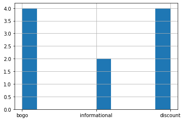

Different offers come with different reward. Two of the offers have the highest reward and there are also two offers have no reward. 
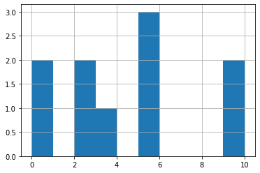
    

Here is a glimps of the data provided,

<div>
<table border="1" class="dataframe">
  <thead>
    <tr style="text-align: right;">
      <th></th>
      <th>reward</th>
      <th>channels</th>
      <th>difficulty</th>
      <th>duration</th>
      <th>offer_type</th>
      <th>id</th>
    </tr>
  </thead>
  <tbody>
    <tr>
      <th>0</th>
      <td>10</td>
      <td>[email, mobile, social]</td>
      <td>10</td>
      <td>7</td>
      <td>bogo</td>
      <td>ae264e3637204a6fb9bb56bc8210ddfd</td>
    </tr>
    <tr>
      <th>1</th>
      <td>10</td>
      <td>[web, email, mobile, social]</td>
      <td>10</td>
      <td>5</td>
      <td>bogo</td>
      <td>4d5c57ea9a6940dd891ad53e9dbe8da0</td>
    </tr>
  </tbody>
</table>
</div>

    
The processing tasks are straigtforward, 
 - process `channels` column and separate the value into one-hot encoded columns. 
 - add a column to indicate the total number of channels that an offer was offered on. 
 - convert duration into hours to facilate data joining later on - rename the id to offer_id for standardization. 

Putting all steps together, data look like this:

<div>
<table border="1" class="dataframe">
  <thead>
    <tr style="text-align: right;">
      <th></th>
      <th>offer_reward</th>
      <th>difficulty</th>
      <th>duration</th>
      <th>offer_id</th>
      <th>email_ch</th>
      <th>num_channels</th>
      <th>social_ch</th>
      <th>web_ch</th>
      <th>mobile_ch</th>
      <th>bogo</th>
      <th>discount</th>
      <th>informational</th>
    </tr>
  </thead>
  <tbody>
    <tr>
      <th>0</th>
      <td>10</td>
      <td>10</td>
      <td>168</td>
      <td>ae264e3637204a6fb9bb56bc8210ddfd</td>
      <td>1</td>
      <td>3</td>
      <td>1</td>
      <td>0</td>
      <td>1</td>
      <td>1</td>
      <td>0</td>
      <td>0</td>
    </tr>
    <tr>
      <th>1</th>
      <td>10</td>
      <td>10</td>
      <td>120</td>
      <td>4d5c57ea9a6940dd891ad53e9dbe8da0</td>
      <td>1</td>
      <td>4</td>
      <td>1</td>
      <td>1</td>
      <td>1</td>
      <td>1</td>
      <td>0</td>
      <td>0</td>
    </tr>
    <tr>
      <th>2</th>
      <td>0</td>
      <td>0</td>
      <td>96</td>
      <td>3f207df678b143eea3cee63160fa8bed</td>
      <td>1</td>
      <td>3</td>
      <td>0</td>
      <td>1</td>
      <td>1</td>
      <td>0</td>
      <td>0</td>
      <td>1</td>
    </tr>
  </tbody>
</table>
</div>


### Profile Dataset

Profile contains demographic data for each customer. Similar to portfolio, the processing is straightforward. 

- Renaming `id` column to customer_id.
- Applying OneHotEncoding to feature `gender`.
- Bucketizing 'age' into age groups by 10s, and apply one-hot encoding.
- Creating additional features based on `became_member_year` to break out year and month when customers became members. 
- Converting `income` into income groups by 10k. 
- There are 4 categories of gender: 'F', 'M', 'O' and None. Put unknwon if gender is missing or with value 'O'. then encode it as one-hot.

One thing to call out is that there are a group of customers who has age = 118, based on inspection, this is an anomalous group and the data will be removed. 


##### `become_member_on` column

The acutal date for the experiment is unknown. If we have known that, we could use it to bucketize the customers into: new member or medium terms or long term members. For now, we leave this column as-is.

#### Customer with age = 118

There are a group of customers having an odd age of 118. The gender and income data are also missing from this group. Logically, we drop the records.

### Combine all processing steps together

<div>
<table border="1" class="dataframe">
  <thead>
    <tr style="text-align: right;">
      <th></th>
      <th>gender</th>
      <th>age</th>
      <th>customer_id</th>
      <th>became_member_on</th>
      <th>income</th>
      <th>became_member_on</th>
      <th>became_member_year</th>
      <th>became_member_month</th>
      <th>membership_length</th>
      <th>became_member_year_2013</th>
      <th>...</th>
      <th>income_40K</th>
      <th>income_50K</th>
      <th>income_60K</th>
      <th>income_70K</th>
      <th>income_80K</th>
      <th>income_90K</th>
      <th>income_100K</th>
      <th>income_110K</th>
      <th>income_120K</th>
      <th>income_130K</th>
    </tr>
  </thead>
  <tbody>
    <tr>
      <th>1</th>
      <td>F</td>
      <td>55</td>
      <td>0610b486422d4921ae7d2bf64640c50b</td>
      <td>20170715</td>
      <td>112000.0</td>
      <td>20170715</td>
      <td>2017</td>
      <td>7</td>
      <td>1514</td>
      <td>0</td>
      <td>...</td>
      <td>0</td>
      <td>0</td>
      <td>0</td>
      <td>0</td>
      <td>0</td>
      <td>0</td>
      <td>0</td>
      <td>1</td>
      <td>0</td>
      <td>0</td>
    </tr>
    <tr>
      <th>3</th>
      <td>F</td>
      <td>75</td>
      <td>78afa995795e4d85b5d9ceeca43f5fef</td>
      <td>20170509</td>
      <td>100000.0</td>
      <td>20170509</td>
      <td>2017</td>
      <td>5</td>
      <td>1581</td>
      <td>0</td>
      <td>...</td>
      <td>0</td>
      <td>0</td>
      <td>0</td>
      <td>0</td>
      <td>0</td>
      <td>0</td>
      <td>1</td>
      <td>0</td>
      <td>0</td>
      <td>0</td>
    </tr>
    <tr>
      <th>5</th>
      <td>M</td>
      <td>68</td>
      <td>e2127556f4f64592b11af22de27a7932</td>
      <td>20180426</td>
      <td>70000.0</td>
      <td>20180426</td>
      <td>2018</td>
      <td>4</td>
      <td>1229</td>
      <td>0</td>
      <td>...</td>
      <td>0</td>
      <td>0</td>
      <td>0</td>
      <td>1</td>
      <td>0</td>
      <td>0</td>
      <td>0</td>
      <td>0</td>
      <td>0</td>
      <td>0</td>
    </tr>
    <tr>
      <th>8</th>
      <td>M</td>
      <td>65</td>
      <td>389bc3fa690240e798340f5a15918d5c</td>
      <td>20180209</td>
      <td>53000.0</td>
      <td>20180209</td>
      <td>2018</td>
      <td>2</td>
      <td>1305</td>
      <td>0</td>
      <td>...</td>
      <td>0</td>
      <td>1</td>
      <td>0</td>
      <td>0</td>
      <td>0</td>
      <td>0</td>
      <td>0</td>
      <td>0</td>
      <td>0</td>
      <td>0</td>
    </tr>
    <tr>
      <th>12</th>
      <td>M</td>
      <td>58</td>
      <td>2eeac8d8feae4a8cad5a6af0499a211d</td>
      <td>20171111</td>
      <td>51000.0</td>
      <td>20171111</td>
      <td>2017</td>
      <td>11</td>
      <td>1395</td>
      <td>0</td>
      <td>...</td>
      <td>0</td>
      <td>1</td>
      <td>0</td>
      <td>0</td>
      <td>0</td>
      <td>0</td>
      <td>0</td>
      <td>0</td>
      <td>0</td>
      <td>0</td>
    </tr>
  </tbody>
</table>
<p>5 rows × 51 columns</p>
</div>


#### Customer by age groups

    
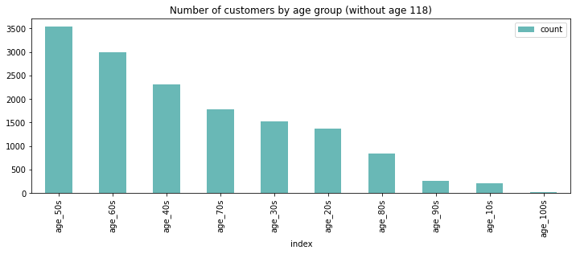
    


Most costumers are between 40 and 80 years with age 50 as the biggest group. 

#### Customer by membership year


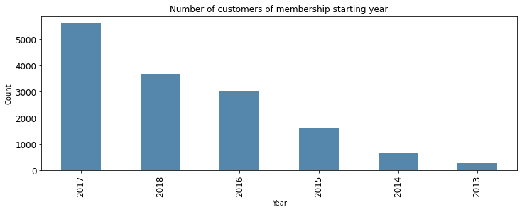
    


#### Membership by gender and year


    
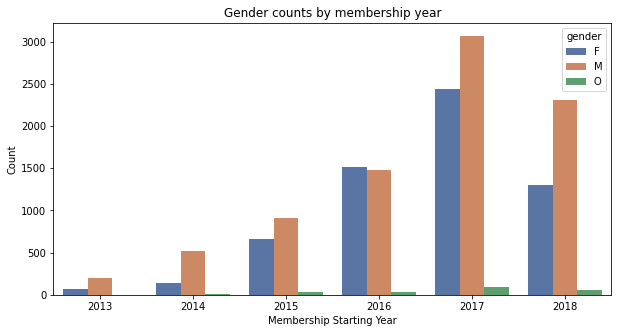
    


Most customers started their membership in 2017. Male customers had significant growth in the year of 2017 and continue exceeding the females in year 2018.

#### Customer by income group

    
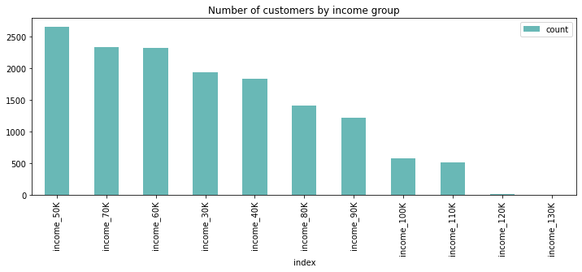
    

Most of customer are in the income buckets of 30k to 80k. There're fewer customers in the higher buckets above 100k. 

## Transcript

Transcript captures all activities and interations from customers. The raw data is from transcript.json with following schema:

- event (str) - record description (ie transaction, offer received, offer viewed, etc.)
- person (str) - customer id
- time (int) - time in hours since start of test. The data begins at time t=0
- value - (dict of strings) - either an offer id or transaction amount depending on the record

**Main tasks**

 - Renaming `person` to customer_id.
 - Extract data from `value` field.
 - Apply one-hot encoding to event column.
 - Removing the records of customers with age 118 since those are anomalous data.


<div>
<table border="1" class="dataframe">
  <thead>
    <tr style="text-align: right;">
      <th></th>
      <th>person</th>
      <th>event</th>
      <th>value</th>
      <th>time</th>
    </tr>
  </thead>
  <tbody>
    <tr>
      <th>0</th>
      <td>78afa995795e4d85b5d9ceeca43f5fef</td>
      <td>offer received</td>
      <td>{'offer id': '9b98b8c7a33c4b65b9aebfe6a799e6d9'}</td>
      <td>0</td>
    </tr>
    <tr>
      <th>1</th>
      <td>a03223e636434f42ac4c3df47e8bac43</td>
      <td>offer received</td>
      <td>{'offer id': '0b1e1539f2cc45b7b9fa7c272da2e1d7'}</td>
      <td>0</td>
    </tr>
    <tr>
      <th>2</th>
      <td>e2127556f4f64592b11af22de27a7932</td>
      <td>offer received</td>
      <td>{'offer id': '2906b810c7d4411798c6938adc9daaa5'}</td>
      <td>0</td>
    </tr>
    <tr>
      <th>3</th>
      <td>8ec6ce2a7e7949b1bf142def7d0e0586</td>
      <td>offer received</td>
      <td>{'offer id': 'fafdcd668e3743c1bb461111dcafc2a4'}</td>
      <td>0</td>
    </tr>
    <tr>
      <th>4</th>
      <td>68617ca6246f4fbc85e91a2a49552598</td>
      <td>offer received</td>
      <td>{'offer id': '4d5c57ea9a6940dd891ad53e9dbe8da0'}</td>
      <td>0</td>
    </tr>
  </tbody>
</table>
</div>


### Encode event column with one-hot


### Transform value column

Value column is a dictionary with keys such as 'reward', 'amount', 'offer id' and 'offer_id'. The task is to separate the data into a set of columns.  Make offer_id column. 


### Put steps together


<div>
<table border="1" class="dataframe">
  <thead>
    <tr style="text-align: right;">
      <th></th>
      <th>customer_id</th>
      <th>event</th>
      <th>time</th>
      <th>offer_id</th>
      <th>reward</th>
      <th>amount</th>
      <th>offer completed</th>
      <th>offer received</th>
      <th>offer viewed</th>
      <th>transaction</th>
    </tr>
  </thead>
  <tbody>
    <tr>
      <th>0</th>
      <td>78afa995795e4d85b5d9ceeca43f5fef</td>
      <td>offer received</td>
      <td>0</td>
      <td>9b98b8c7a33c4b65b9aebfe6a799e6d9</td>
      <td>0.0</td>
      <td>0.0</td>
      <td>0</td>
      <td>1</td>
      <td>0</td>
      <td>0</td>
    </tr>
    <tr>
      <th>1</th>
      <td>a03223e636434f42ac4c3df47e8bac43</td>
      <td>offer received</td>
      <td>0</td>
      <td>0b1e1539f2cc45b7b9fa7c272da2e1d7</td>
      <td>0.0</td>
      <td>0.0</td>
      <td>0</td>
      <td>1</td>
      <td>0</td>
      <td>0</td>
    </tr>
    <tr>
      <th>2</th>
      <td>e2127556f4f64592b11af22de27a7932</td>
      <td>offer received</td>
      <td>0</td>
      <td>2906b810c7d4411798c6938adc9daaa5</td>
      <td>0.0</td>
      <td>0.0</td>
      <td>0</td>
      <td>1</td>
      <td>0</td>
      <td>0</td>
    </tr>
    <tr>
      <th>3</th>
      <td>8ec6ce2a7e7949b1bf142def7d0e0586</td>
      <td>offer received</td>
      <td>0</td>
      <td>fafdcd668e3743c1bb461111dcafc2a4</td>
      <td>0.0</td>
      <td>0.0</td>
      <td>0</td>
      <td>1</td>
      <td>0</td>
      <td>0</td>
    </tr>
    <tr>
      <th>4</th>
      <td>68617ca6246f4fbc85e91a2a49552598</td>
      <td>offer received</td>
      <td>0</td>
      <td>4d5c57ea9a6940dd891ad53e9dbe8da0</td>
      <td>0.0</td>
      <td>0.0</td>
      <td>0</td>
      <td>1</td>
      <td>0</td>
      <td>0</td>
    </tr>
  </tbody>
</table>
</div>


## Create offer-response dataset

This is the most signfication step for the data processing where we combine transcript, portfolio datasets and produce new dataset grouped by customer and offer. 

The major objective for this project is to analyze how customer responds to an offer. The analysis can't depend on the offer completed because a customer can complete an offer without receiving nor viewing offer. To process the data, two columns are created, `responded`, `purchase_during_offer`. That an offer is responded is defined as following :

1. For an information offer, it is reviewed and purcahse is made during offer period.
2. For a discount or bogo offer, it is considered as responded if there are "offer completed" events and purchase made during the offer period.

The offer period is defined as time between an offer is received until an offer passes its duration. There are large number of records in the transcript dataset where the same offer has been sent to the customer. In that case, the offer starts with the first time when customer recieves it and ends when the last offer expires.

`purchase_during_offer` are the transctions recorded during the offer period.


### Offer-response dataset

The **dataprocessing.offer-response** module handles all the logic to create offer-response dataset.


<div>
<table border="1" class="dataframe">
  <thead>
    <tr style="text-align: right;">
      <th></th>
      <th>customer_id</th>
      <th>offer_id</th>
      <th>offer_received_sum</th>
      <th>offer_viewed_sum</th>
      <th>offer_completed_sum</th>
      <th>offer_reward</th>
      <th>difficulty</th>
      <th>duration</th>
      <th>web_ch</th>
      <th>num_channels</th>
      <th>...</th>
      <th>income_40K</th>
      <th>income_50K</th>
      <th>income_60K</th>
      <th>income_70K</th>
      <th>income_80K</th>
      <th>income_90K</th>
      <th>income_100K</th>
      <th>income_110K</th>
      <th>income_120K</th>
      <th>income_130K</th>
    </tr>
  </thead>
  <tbody>
    <tr>
      <th>0</th>
      <td>0009655768c64bdeb2e877511632db8f</td>
      <td>2906b810c7d4411798c6938adc9daaa5</td>
      <td>1</td>
      <td>0</td>
      <td>1</td>
      <td>2</td>
      <td>10</td>
      <td>168</td>
      <td>1</td>
      <td>3</td>
      <td>...</td>
      <td>0.0</td>
      <td>0.0</td>
      <td>0.0</td>
      <td>1.0</td>
      <td>0.0</td>
      <td>0.0</td>
      <td>0.0</td>
      <td>0.0</td>
      <td>0.0</td>
      <td>0.0</td>
    </tr>
    <tr>
      <th>1</th>
      <td>0009655768c64bdeb2e877511632db8f</td>
      <td>3f207df678b143eea3cee63160fa8bed</td>
      <td>1</td>
      <td>1</td>
      <td>0</td>
      <td>0</td>
      <td>0</td>
      <td>96</td>
      <td>1</td>
      <td>3</td>
      <td>...</td>
      <td>0.0</td>
      <td>0.0</td>
      <td>0.0</td>
      <td>1.0</td>
      <td>0.0</td>
      <td>0.0</td>
      <td>0.0</td>
      <td>0.0</td>
      <td>0.0</td>
      <td>0.0</td>
    </tr>
    <tr>
      <th>2</th>
      <td>0009655768c64bdeb2e877511632db8f</td>
      <td>5a8bc65990b245e5a138643cd4eb9837</td>
      <td>1</td>
      <td>1</td>
      <td>0</td>
      <td>0</td>
      <td>0</td>
      <td>72</td>
      <td>0</td>
      <td>3</td>
      <td>...</td>
      <td>0.0</td>
      <td>0.0</td>
      <td>0.0</td>
      <td>1.0</td>
      <td>0.0</td>
      <td>0.0</td>
      <td>0.0</td>
      <td>0.0</td>
      <td>0.0</td>
      <td>0.0</td>
    </tr>
    <tr>
      <th>3</th>
      <td>0009655768c64bdeb2e877511632db8f</td>
      <td>f19421c1d4aa40978ebb69ca19b0e20d</td>
      <td>1</td>
      <td>1</td>
      <td>1</td>
      <td>5</td>
      <td>5</td>
      <td>120</td>
      <td>1</td>
      <td>4</td>
      <td>...</td>
      <td>0.0</td>
      <td>0.0</td>
      <td>0.0</td>
      <td>1.0</td>
      <td>0.0</td>
      <td>0.0</td>
      <td>0.0</td>
      <td>0.0</td>
      <td>0.0</td>
      <td>0.0</td>
    </tr>
    <tr>
      <th>4</th>
      <td>0009655768c64bdeb2e877511632db8f</td>
      <td>fafdcd668e3743c1bb461111dcafc2a4</td>
      <td>1</td>
      <td>1</td>
      <td>1</td>
      <td>2</td>
      <td>10</td>
      <td>240</td>
      <td>1</td>
      <td>4</td>
      <td>...</td>
      <td>0.0</td>
      <td>0.0</td>
      <td>0.0</td>
      <td>1.0</td>
      <td>0.0</td>
      <td>0.0</td>
      <td>0.0</td>
      <td>0.0</td>
      <td>0.0</td>
      <td>0.0</td>
    </tr>
  </tbody>
</table>
<p>5 rows × 68 columns</p>
</div>


There are total 63K samples in the dataset with 68 different fields. Let's look at some of the business related question based on the data from this set. 

#### How do customers respond the offers, e.g. what is the most popular offer?

As part of producing offer-response dataset, a summary dataset (response_summary) was created based on the new dataset. This dataset reveals the responding rate from customers. 

<div>
<table border="1" class="dataframe">
  <thead>
    <tr style="text-align: right;">
      <th></th>
      <th>offer_id</th>
      <th>count</th>
      <th>responded_count</th>
      <th>success_rate</th>
      <th>offer_type</th>
    </tr>
  </thead>
  <tbody>
    <tr>
      <th>9</th>
      <td>fafdcd668e3743c1bb461111dcafc2a4</td>
      <td>6332</td>
      <td>4433</td>
      <td>70.01</td>
      <td>discount</td>
    </tr>
    <tr>
      <th>1</th>
      <td>2298d6c36e964ae4a3e7e9706d1fb8c2</td>
      <td>6325</td>
      <td>4313</td>
      <td>68.19</td>
      <td>discount</td>
    </tr>
    <tr>
      <th>5</th>
      <td>5a8bc65990b245e5a138643cd4eb9837</td>
      <td>6320</td>
      <td>4002</td>
      <td>63.32</td>
      <td>informational</td>
    </tr>
    <tr>
      <th>8</th>
      <td>f19421c1d4aa40978ebb69ca19b0e20d</td>
      <td>6262</td>
      <td>3655</td>
      <td>58.37</td>
      <td>bogo</td>
    </tr>
    <tr>
      <th>4</th>
      <td>4d5c57ea9a6940dd891ad53e9dbe8da0</td>
      <td>6330</td>
      <td>2825</td>
      <td>44.63</td>
      <td>bogo</td>
    </tr>
    <tr>
      <th>7</th>
      <td>ae264e3637204a6fb9bb56bc8210ddfd</td>
      <td>6374</td>
      <td>2843</td>
      <td>44.60</td>
      <td>bogo</td>
    </tr>
    <tr>
      <th>3</th>
      <td>3f207df678b143eea3cee63160fa8bed</td>
      <td>6331</td>
      <td>2618</td>
      <td>41.35</td>
      <td>informational</td>
    </tr>
    <tr>
      <th>6</th>
      <td>9b98b8c7a33c4b65b9aebfe6a799e6d9</td>
      <td>6355</td>
      <td>2504</td>
      <td>39.40</td>
      <td>bogo</td>
    </tr>
    <tr>
      <th>2</th>
      <td>2906b810c7d4411798c6938adc9daaa5</td>
      <td>6285</td>
      <td>2415</td>
      <td>38.42</td>
      <td>discount</td>
    </tr>
    <tr>
      <th>0</th>
      <td>0b1e1539f2cc45b7b9fa7c272da2e1d7</td>
      <td>6374</td>
      <td>1472</td>
      <td>23.09</td>
      <td>discount</td>
    </tr>
  </tbody>
</table>
</div>


The most popular offer (fafdcd668e3743c1bb461111dcafc2a4) is a discount offer which more than 70% offer sent were responded. The least popular offer is also a discount offer(0b1e1539f2cc45b7b9fa7c272da2e1d7) which around 23% offer sent were responded. Both offers had the same duration, however the difficulty of the more popular one was a half of the other one.

#### How do offer types affect respondence ? Do customers view informational offers?


<div>
<table border="1" class="dataframe">
  <thead>
    <tr style="text-align: right;">
      <th></th>
      <th>offer_id</th>
      <th>count</th>
      <th>responded_count</th>
      <th>success_rate</th>
      <th>offer_type</th>
    </tr>
  </thead>
  <tbody>
    <tr>
      <th>5</th>
      <td>5a8bc65990b245e5a138643cd4eb9837</td>
      <td>6320</td>
      <td>4002</td>
      <td>63.32</td>
      <td>informational</td>
    </tr>
    <tr>
      <th>3</th>
      <td>3f207df678b143eea3cee63160fa8bed</td>
      <td>6331</td>
      <td>2618</td>
      <td>41.35</td>
      <td>informational</td>
    </tr>
  </tbody>
</table>
</div>


Offer types affect respondence as well as the difficulty of these offers. Based on data above, customers not only viewed the informational offers, they also made purchase during the offer. 

#### Which offer has made the most for Starbucks? What's the difference between BOGO offers and Discount offers?

#### Does income/age play a factor on completion of the offers ?

The distribution of income by gender can be viewed in following charts. The minimum and maximum incomes for both male and female are similar but the number of male customers in low-income level is higher. Also, income distribution pattern for Others is also similar to males and females. The minimum and maximum incomes are lower than the other two groups.


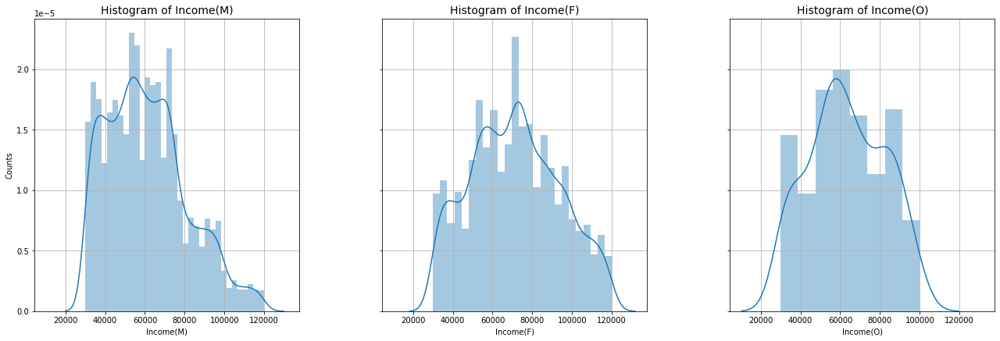
    


**Offer Interactions by Gender**


    
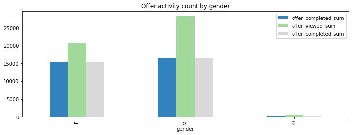
    


From the chart above, Male customers were very active in terms of viewing the offer received.

**Offer Response by Gender**


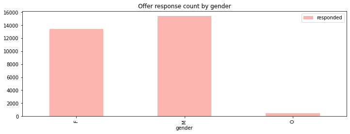
    


Male customers viewed lot of offers and also responded more often to these offers than femable customers.

**Offer Purchase by Gender**
    
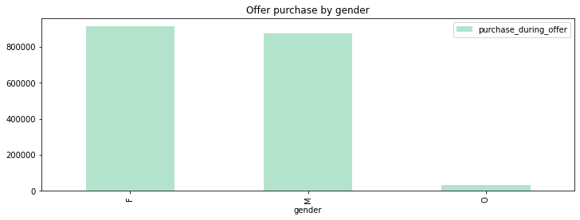
    

Even though Male customers were more active than female customers in terms of offer activties, in terms of money spending, female customers spent more money during the offers!


## Modeling the Offer Response

## Introduction

Starbucks engages customers by sending them various offers regularly. How do we know which demographic groups respond best to which offer type? In the simulated dataset, we have 10 different offers and with varying level of responses. Our task is to combine transaction, demographic and offer data to train a binary classifier to predict whether or not an customer will respond to an offer.

From the project introduction, we know that the `offer completed` is not necessarily an accurate indicator on whether a customer responds to an offer because customer can "complete" offer without receiving nor viewing offer. The data preprocessing and cleaning present a great challenge. After analyzing existing data, here are the two sceniaros that an offer is considered as respondended:

- For an information offer, it is reviewed and purcahse is made during offer period. 
- For a discount or bogo offer, it is considered as responded if there are "offer completed" events and purchase made during the offer period. 

The offer period starts when a customer receives an offer and ends when it duration expires, i.e. offer period equals the offer receiving time plus its duration. In the case that the same offer has been sent to the customer, the offer starts with the first time when customer recieves it and ends when the last offer expires. 

The predictive modeling is based on algorithm and support from sklearn. 


    Index(['gender', 'age', 'customer_id', 'income', 'became_member_year',
           'became_member_month', 'membership_length', 'became_member_year_2013',
           'became_member_year_2014', 'became_member_year_2015',
           'became_member_year_2016', 'became_member_year_2017',
           'became_member_year_2018', 'became_member_month_1',
           'became_member_month_2', 'became_member_month_3',
           'became_member_month_4', 'became_member_month_5',
           'became_member_month_6', 'became_member_month_7',
           'became_member_month_8', 'became_member_month_9',
           'became_member_month_10', 'became_member_month_11',
           'became_member_month_12', 'F', 'M', 'O', 'age_10s', 'age_20s',
           'age_30s', 'age_40s', 'age_50s', 'age_60s', 'age_70s', 'age_80s',
           'age_90s', 'age_100s', 'income_30K', 'income_40K', 'income_50K',
           'income_60K', 'income_70K', 'income_80K', 'income_90K', 'income_100K',
           'income_110K', 'income_120K', 'income_130K'],
          dtype='object')


<div>
<table border="1" class="dataframe">
  <thead>
    <tr style="text-align: right;">
      <th></th>
      <th>customer_id</th>
      <th>event</th>
      <th>time</th>
      <th>offer_id</th>
      <th>reward</th>
      <th>amount</th>
      <th>offer completed</th>
      <th>offer received</th>
      <th>offer viewed</th>
      <th>transaction</th>
    </tr>
  </thead>
  <tbody>
    <tr>
      <th>0</th>
      <td>78afa995795e4d85b5d9ceeca43f5fef</td>
      <td>offer received</td>
      <td>0</td>
      <td>9b98b8c7a33c4b65b9aebfe6a799e6d9</td>
      <td>0.0</td>
      <td>0.0</td>
      <td>0</td>
      <td>1</td>
      <td>0</td>
      <td>0</td>
    </tr>
    <tr>
      <th>1</th>
      <td>a03223e636434f42ac4c3df47e8bac43</td>
      <td>offer received</td>
      <td>0</td>
      <td>0b1e1539f2cc45b7b9fa7c272da2e1d7</td>
      <td>0.0</td>
      <td>0.0</td>
      <td>0</td>
      <td>1</td>
      <td>0</td>
      <td>0</td>
    </tr>
    <tr>
      <th>2</th>
      <td>e2127556f4f64592b11af22de27a7932</td>
      <td>offer received</td>
      <td>0</td>
      <td>2906b810c7d4411798c6938adc9daaa5</td>
      <td>0.0</td>
      <td>0.0</td>
      <td>0</td>
      <td>1</td>
      <td>0</td>
      <td>0</td>
    </tr>
    <tr>
      <th>3</th>
      <td>8ec6ce2a7e7949b1bf142def7d0e0586</td>
      <td>offer received</td>
      <td>0</td>
      <td>fafdcd668e3743c1bb461111dcafc2a4</td>
      <td>0.0</td>
      <td>0.0</td>
      <td>0</td>
      <td>1</td>
      <td>0</td>
      <td>0</td>
    </tr>
    <tr>
      <th>4</th>
      <td>68617ca6246f4fbc85e91a2a49552598</td>
      <td>offer received</td>
      <td>0</td>
      <td>4d5c57ea9a6940dd891ad53e9dbe8da0</td>
      <td>0.0</td>
      <td>0.0</td>
      <td>0</td>
      <td>1</td>
      <td>0</td>
      <td>0</td>
    </tr>
  </tbody>
</table>
</div>

## Feature extraction

Even though the transcript dataset contains info for offers and transactions that the customer made, it is not organized by customer and offer thus not directly usable. In addtion, we'll need create labels for modeling, i.e. a column of **responded**. for a combination of a customer and an offer. To do that, we'll  need to extract purchase made during the offer period. If we look at this from software development perspective, these are really three domain entities; customers, offers and transctions. To separate "offers" and "transctions" in transcript data, we can rely on the `event` column. If the value of event is 'offer received', 'offer viewed' or 'offer completed', it belongs to offers dataset, otherwise, it goes to transctions. The percentage of these events are following:


    transaction        45.33
    offer received     24.88
    offer viewed       18.83
    offer completed    10.95
    Name: event, dtype: float64

The **transactions** are asscoiated with customers i.e. doesn't have offer id. The general stragety is to extract the customer ids in the offers dataset, iterate offers by a customer to process transactions.  Cacluating the offer period then use it to filter the transctions associated to determine whether an offer is responded. The feature extraction logic is implemented in data_processing.offer_response **combine** method. 

#### Combined Offer Response dataset

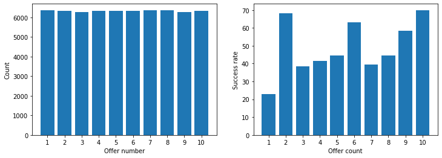
    

From the results shown above, we notice that the number of offers sent to customers is almost identical. Based on the rate that customers responded, two of the discount offer number **10** and **2** are the most responded with success rates 70% and 68%. The least responded offer is number 4 with rate 23%.

## Build models

### Final Feature selection

Currently offer_response dataset has 68 columns, and not all of them are useful set of columns from offer_response. 


The final feature dataset has ~55k samples with 55 columns.

### Create train and test datasets

Column `responded` is our label column, the rest goes to as input. We are going split data into .7 for training and .3 for test. To minimize the impact of large numbers, we are going to apply MaxScaler for following colummns 

 - 'difficulty', 'duration', 'offer_reward', 'membership_length' and 'membership_length'
 
Combine things together ...

<div>
<table border="1" class="dataframe">
  <thead>
    <tr style="text-align: right;">
      <th></th>
      <th>web_ch</th>
      <th>num_channels</th>
      <th>email_ch</th>
      <th>social_ch</th>
      <th>mobile_ch</th>
      <th>bogo</th>
      <th>discount</th>
      <th>informational</th>
      <th>became_member_year_2013</th>
      <th>became_member_year_2014</th>
      <th>...</th>
      <th>income_90K</th>
      <th>income_100K</th>
      <th>income_110K</th>
      <th>income_120K</th>
      <th>income_130K</th>
      <th>difficulty</th>
      <th>duration</th>
      <th>offer_reward</th>
      <th>membership_length</th>
      <th>purchase_during_offer</th>
    </tr>
  </thead>
  <tbody>
    <tr>
      <th>722</th>
      <td>0</td>
      <td>3</td>
      <td>1</td>
      <td>1</td>
      <td>1</td>
      <td>0</td>
      <td>0</td>
      <td>1</td>
      <td>0.0</td>
      <td>0.0</td>
      <td>...</td>
      <td>0.0</td>
      <td>0.0</td>
      <td>0.0</td>
      <td>0.0</td>
      <td>0.0</td>
      <td>0.00</td>
      <td>0.000000</td>
      <td>0.0</td>
      <td>0.102578</td>
      <td>0.054901</td>
    </tr>
    <tr>
      <th>2362</th>
      <td>1</td>
      <td>3</td>
      <td>1</td>
      <td>0</td>
      <td>1</td>
      <td>0</td>
      <td>0</td>
      <td>1</td>
      <td>0.0</td>
      <td>0.0</td>
      <td>...</td>
      <td>0.0</td>
      <td>0.0</td>
      <td>0.0</td>
      <td>0.0</td>
      <td>0.0</td>
      <td>0.00</td>
      <td>0.142857</td>
      <td>0.0</td>
      <td>0.229292</td>
      <td>0.000000</td>
    </tr>
    <tr>
      <th>13558</th>
      <td>1</td>
      <td>4</td>
      <td>1</td>
      <td>1</td>
      <td>1</td>
      <td>0</td>
      <td>1</td>
      <td>0</td>
      <td>0.0</td>
      <td>0.0</td>
      <td>...</td>
      <td>0.0</td>
      <td>0.0</td>
      <td>0.0</td>
      <td>0.0</td>
      <td>0.0</td>
      <td>0.35</td>
      <td>0.571429</td>
      <td>0.3</td>
      <td>0.066923</td>
      <td>0.000000</td>
    </tr>
    <tr>
      <th>35556</th>
      <td>1</td>
      <td>3</td>
      <td>1</td>
      <td>0</td>
      <td>1</td>
      <td>1</td>
      <td>0</td>
      <td>0</td>
      <td>0.0</td>
      <td>0.0</td>
      <td>...</td>
      <td>0.0</td>
      <td>0.0</td>
      <td>0.0</td>
      <td>0.0</td>
      <td>0.0</td>
      <td>0.25</td>
      <td>0.571429</td>
      <td>0.5</td>
      <td>0.160176</td>
      <td>0.035751</td>
    </tr>
    <tr>
      <th>47193</th>
      <td>1</td>
      <td>4</td>
      <td>1</td>
      <td>1</td>
      <td>1</td>
      <td>0</td>
      <td>1</td>
      <td>0</td>
      <td>0.0</td>
      <td>1.0</td>
      <td>...</td>
      <td>0.0</td>
      <td>0.0</td>
      <td>0.0</td>
      <td>0.0</td>
      <td>0.0</td>
      <td>0.35</td>
      <td>0.571429</td>
      <td>0.3</td>
      <td>0.896873</td>
      <td>0.013843</td>
    </tr>
  </tbody>
</table>
<p>5 rows × 55 columns</p>
</div>

**Check whether we have any large numbers**

We don't have large numbers.

**Check whether the label data are balanced**

    value stats:
    1    52.94
    0    47.06
    Name: responded, dtype: float64
    
    Values std: 2.9399999999999977, threshod: 10.
    Values for responded is balanced.


```python
offerfe.check_label_balance(y_test, threshold=10)
```

    value stats:
    1    53.33
    0    46.67
    Name: responded, dtype: float64
    
    Values std: 3.3299999999999983, threshod: 10.
    Values for responded is balanced.


The delta of values (0, 1) in training and test label sets are within 3%, we can conclude that our training/testing dataset is nearly balanced. 

### Training

#### Model evaluation metrics

The training dataset is well balanced in terms of distribution of of labels. Evalaution metrics like precision, recall, and f1-score are good to use. 
- precision answers: what portion of postive identificaiton was actually correct?
- recall answers: what portion of active postive was identified correctly?
- F1-score represents "the harmonic mean of the precision and recall metrics".

In our training, we premarily focus on using f1-score.

#### Choice of Classifers

There are many different type of classifers that we can choose from sklearn. We are going to try out three: RandomForestClassifier, GradientBoostingClassifier and AdaBoostClassifier and compare their performance.


    [RandomForestClassifier(random_state=42),
     GradientBoostingClassifier(random_state=42),
     AdaBoostClassifier(random_state=42)]


For the first path, we are just going through all classifers without any addtional tuning params to see how they fair.


```python
clf_names = []
clf_f1_scores = []
clf_best_models = []
clf_time_taken = []

for clf in offerm.CLASSIFER_LIST:

    model, f1_score, time_taken = offerm.train(clf, {}, X_train, y_train, scoring='f1', cv=5, verbose=0)
    clf_names.append(clf.__class__.__name__)
    clf_f1_scores.append(f1_score)
    clf_best_models.append(model)
    clf_time_taken.append(time_taken)
    
result_dict = {'best_f1_score': clf_f1_scores,  'time_taken(s)': clf_time_taken, "best_model": clf_best_models}
result_df = pd.DataFrame(result_dict, index=clf_names)
result_df
```

    Training RandomForestClassifier :
    Time taken : 8.2 secs.
    Best f1_score : 1.0
    ****************************************
    Training GradientBoostingClassifier :
    Time taken : 16.77 secs.
    Best f1_score : 1.0
    ****************************************
    Training AdaBoostClassifier :
    Time taken : 0.25 secs.
    Best f1_score : 1.0
    ****************************************


<div>

<table border="1" class="dataframe">
  <thead>
    <tr style="text-align: right;">
      <th></th>
      <th>best_f1_score</th>
      <th>time_taken(s)</th>
      <th>best_model</th>
    </tr>
  </thead>
  <tbody>
    <tr>
      <th>RandomForestClassifier</th>
      <td>1.0</td>
      <td>8.20</td>
      <td>(DecisionTreeClassifier(max_features='auto', r...</td>
    </tr>
    <tr>
      <th>GradientBoostingClassifier</th>
      <td>1.0</td>
      <td>16.77</td>
      <td>([DecisionTreeRegressor(criterion='friedman_ms...</td>
    </tr>
    <tr>
      <th>AdaBoostClassifier</th>
      <td>1.0</td>
      <td>0.25</td>
      <td>(DecisionTreeClassifier(max_depth=1, random_st...</td>
    </tr>
  </tbody>
</table>
</div>


All three classifers were achiving almost perfect f1_score(approx. 1.0) on its training dataset. How is this possible, we are going to explore this shortly. 

#### Model evaluation - Confusion Matrix

Since all three classifier have almost identical performance. We're going to look at the confusion matrix from AdaBoostClassifier since it takes the shortest time to train.


```python
randomforest_clf = clf_best_models[0]
randomforest_clf.__class__.__name__
```


    'RandomForestClassifier'


```python
y_pred = randomforest_clf.predict(X_test)
conf_matrix = offerm.get_confusion_matrix(y_test, y_pred, normalized=True)
```

    true postives: 8834, false postives: 0
    true negatives: 7731, false negatives: 2
    
    Normalized confusion matrix:
    [[1.00000000e+00 0.00000000e+00]
     [2.26346763e-04 9.99773653e-01]]


Even for the test dataset, the score was perfect!

#### Understand the model performance

A nearly perfect score is definitely delightful however worrysome. We're going to look at what contributes to this good score by looking at the feature importance!


<div>
<table border="1" class="dataframe">
  <thead>
    <tr style="text-align: right;">
      <th></th>
      <th>feature</th>
      <th>imp_perc</th>
    </tr>
  </thead>
  <tbody>
    <tr>
      <th>0</th>
      <td>purchase_during_offer</td>
      <td>80.70</td>
    </tr>
    <tr>
      <th>1</th>
      <td>membership_length</td>
      <td>4.29</td>
    </tr>
    <tr>
      <th>2</th>
      <td>social_ch</td>
      <td>2.15</td>
    </tr>
    <tr>
      <th>3</th>
      <td>num_channels</td>
      <td>1.25</td>
    </tr>
    <tr>
      <th>4</th>
      <td>became_member_year_2018</td>
      <td>1.23</td>
    </tr>
    <tr>
      <th>5</th>
      <td>difficulty</td>
      <td>0.83</td>
    </tr>
    <tr>
      <th>6</th>
      <td>became_member_year_2016</td>
      <td>0.61</td>
    </tr>
    <tr>
      <th>7</th>
      <td>offer_reward</td>
      <td>0.60</td>
    </tr>
    <tr>
      <th>8</th>
      <td>duration</td>
      <td>0.56</td>
    </tr>
    <tr>
      <th>9</th>
      <td>mobile_ch</td>
      <td>0.52</td>
    </tr>
  </tbody>
</table>
</div>


    
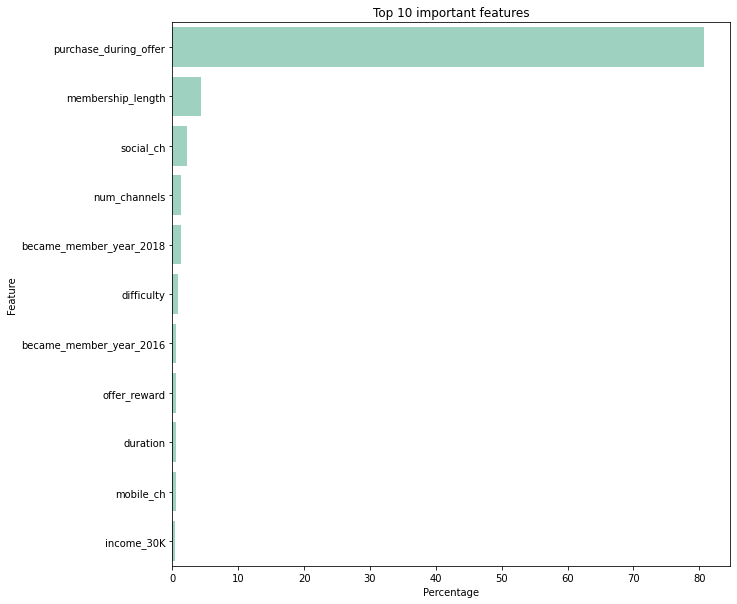
    

From the results shown above we notice that the `purchase_during_offer` is the most dominiate feature. The second is the membership_length.  Other features have very little influence to the prediction. `purchase_during_offer` is a compound feature that we calculated based on the purchase that customer made during an offer period. If we know a purchase made, we know customer repsonded and vice versa. In this light, the classifer is trained via machine learning, however this is not quite a true `predictive` model. Next, we are going to look into building a model without the knowledge of `purchase_during_offer`.

### Training without knowing the purchase made
We're going to remove `purchase_during_offer` from our features and retrain the model. 


```python
cols_removal = [
    'customer_id',
    'offer_id',
    'offer_received_sum',
    'offer_viewed_sum',
    'offer_completed_sum',
    'age',
    'became_member_on',
    'became_member_year',
    'became_member_month',
    'income',
    'gender',
    'purchase_during_offer',
]

features_to_scale = ['difficulty', 'duration', 'offer_reward', 'membership_length']

X_train, X_test, y_train, y_test = offerfe.create_training_data(offer_response_df, label_col='responded', test_size=0.3, cols_removal=cols_removal, features_to_scale=features_to_scale)

new_clf_names = []
new_clf_f1_scores = []
new_clf_best_models = []
new_clf_time_taken = []

for clf in offerm.CLASSIFER_LIST:

    model, f1_score, time_taken = offerm.train(clf, {}, X_train, y_train, scoring='f1', cv=5, verbose=0)
    new_clf_names.append(clf.__class__.__name__)
    new_clf_f1_scores.append(f1_score)
    new_clf_best_models.append(model)
    new_clf_time_taken.append(time_taken)
```

    Training RandomForestClassifier :
    Time taken : 17.92 secs.
    Best f1_score : 0.6703
    ****************************************
    Training GradientBoostingClassifier :
    Time taken : 23.91 secs.
    Best f1_score : 0.7098
    ****************************************
    Training AdaBoostClassifier :
    Time taken : 8.55 secs.
    Best f1_score : 0.7003
    ****************************************


```python
new_result_dict = {'best_f1_score': new_clf_f1_scores,  'time_taken(s)': new_clf_time_taken, "best_model": new_clf_best_models}
new_result_df = pd.DataFrame(new_result_dict, index=new_clf_names)
new_result_df
```


<div>

<table border="1" class="dataframe">
  <thead>
    <tr style="text-align: right;">
      <th></th>
      <th>best_f1_score</th>
      <th>time_taken(s)</th>
      <th>best_model</th>
    </tr>
  </thead>
  <tbody>
    <tr>
      <th>RandomForestClassifier</th>
      <td>0.670284</td>
      <td>17.92</td>
      <td>(DecisionTreeClassifier(max_features='auto', r...</td>
    </tr>
    <tr>
      <th>GradientBoostingClassifier</th>
      <td>0.709751</td>
      <td>23.91</td>
      <td>([DecisionTreeRegressor(criterion='friedman_ms...</td>
    </tr>
    <tr>
      <th>AdaBoostClassifier</th>
      <td>0.700313</td>
      <td>8.55</td>
      <td>(DecisionTreeClassifier(max_depth=1, random_st...</td>
    </tr>
  </tbody>
</table>
</div>


The f1 score for all three classifer is lower but all still reasonable. For all 3, GradientBoostingClassifier has the best performance. 

**Confusion Matrix**


    true postives: 5924, false postives: 2973
    true negatives: 4758, false negatives: 2912
    
    Normalized confusion matrix:
    [[0.61544432 0.38455568]
     [0.32956089 0.67043911]]


The results shows our model is able to identify 71% of cases that customer responded to an offer, 62% of cases that customer didn't respond to an offer. False Negatives is less than False positives, this means that Starbucks would less likely to miss sending offers to individuals who can respond and would still in balance of not sending offers to customers who would not respond.

**Feature importance**

We are going to look into feature importance output from GradientBoostingClassifier.

<div>

<table border="1" class="dataframe">
  <thead>
    <tr style="text-align: right;">
      <th></th>
      <th>feature</th>
      <th>imp_perc</th>
    </tr>
  </thead>
  <tbody>
    <tr>
      <th>0</th>
      <td>membership_length</td>
      <td>35.86</td>
    </tr>
    <tr>
      <th>1</th>
      <td>social_ch</td>
      <td>2.58</td>
    </tr>
    <tr>
      <th>2</th>
      <td>age_50s</td>
      <td>2.43</td>
    </tr>
    <tr>
      <th>3</th>
      <td>num_channels</td>
      <td>2.41</td>
    </tr>
    <tr>
      <th>4</th>
      <td>age_60s</td>
      <td>2.41</td>
    </tr>
    <tr>
      <th>5</th>
      <td>difficulty</td>
      <td>2.14</td>
    </tr>
    <tr>
      <th>6</th>
      <td>age_40s</td>
      <td>2.08</td>
    </tr>
    <tr>
      <th>7</th>
      <td>income_50K</td>
      <td>1.94</td>
    </tr>
    <tr>
      <th>8</th>
      <td>age_70s</td>
      <td>1.89</td>
    </tr>
    <tr>
      <th>9</th>
      <td>income_70K</td>
      <td>1.86</td>
    </tr>
  </tbody>
</table>
</div>

    
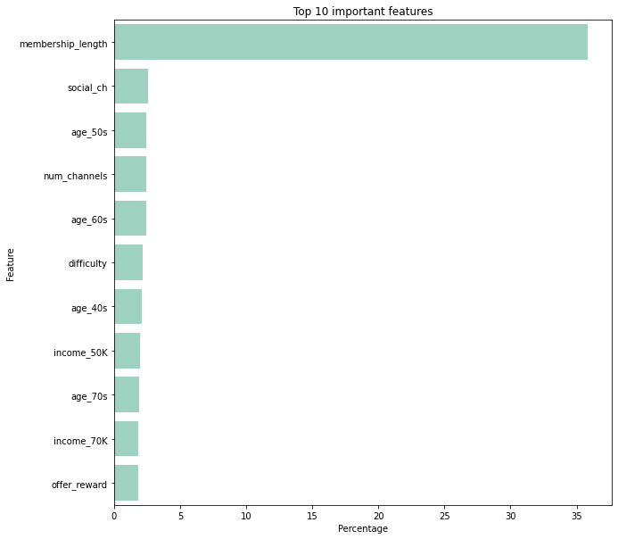
    

Inferring from the top 10 features, the factors that influence the customer's response to an offer, 
    
- Number one, the length of the membership. The longer of being a member, it is more likely for she/he to respond. This intuitively makes sense.
- Offer broadcasted via 'social' channel is ranked as the second. This also makes sense due to greater media exposure.  
- num_channels is calculated and indicates the number of channels that the offer is visible. The higher number of channels, the more likely customers will see it and respond.
- Multiple age groups, 'age_40s', 'age_50s', 'age_60s' and 'age_70s' are on the list. This indicates age of the customer should be carefully looked at when sending an offer.    
- 'income_70ths' feature, which represents if customer's income is in bucket of 70k to 80K. This may be a significant group for engagement. 

### Hyperparameter Tuning

We are going to useing GridSearch to look for best RandomForestClassifier with following set of parameters. The steps and code are from [In Depth: Parameter tuning for Random Forest](https://medium.com/all-things-ai/in-depth-parameter-tuning-for-random-forest-d67bb7e920d).

**n_estimators**

n_estimators represents the number of trees in the forest. Usually the larger the number, the bette model learns the data. However, adding a lot of estimators can slow down the training process considerably without benefit of performance.


```python
n_estimators = [1, 2, 4, 8, 16, 32, 64, 100, 200]
```


    
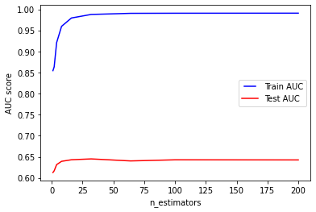
    


From above data, we can stop at 16 trees as increasing the number of estimator doesn't increase the accuracy. 

**max_depth**

max_depth represents the depth of each tree in the forest. The deeper the tree, the more splits it has and it captures more information about the data. We fit each decision tree with depths ranging from 1 to 32 and plot the training and test errors.


```python
max_depths = np.linspace(1, 32, 32, endpoint=True)
```

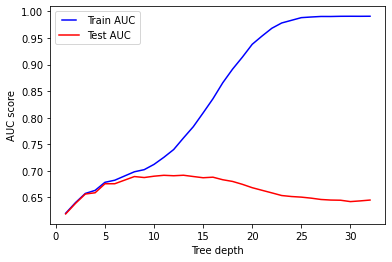
    


We see that our model overfits for large depth values. With large max_depths, model predicts well for training data, however, it fails to generalize to test data.

**min_les_split**

min_les_split represents the minimum number of samples required to split an internal node. This can vary between considering at least one sample at each node to considering all of the samples at each node. When we increase this parameter, each tree in the forest becomes more constrained as it has to consider more samples at each node. Here we will vary the parameter from 10% to 100% of the samples
   
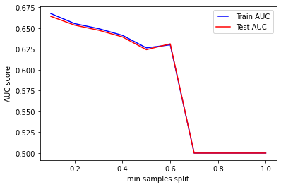
    


We can clearly see that when we require all of the samples at each node, the model cannot learn enough about the data. This is an underfitting case.

**min_samples_leaf**

min_samples_leaf is The minimum number of samples required to be at a leaf node. This parameter is similar to min_samples_splits, however, this describe the minimum number of samples of samples at the leafs, the base of the tree.


    
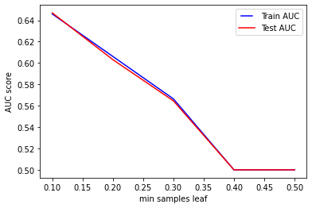
    


Same conclusion as to previous parameter. Increasing this value can cause underfitting.

**max_features**

max_features represents the number of features to consider when looking for the best split.

    
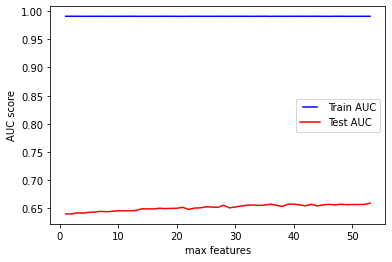
    


This is also an overfitting case. It's unexpected to get overfitting for all values of max_features. However, according to sklearn documentation for random forest, the search for a split does not stop until at least one valid partition of the node samples is found, even if it requires to effectively inspect more than max_features features.

**Final model**


```python
rf_clf = RandomForestClassifier(n_estimators=32, n_jobs=-1, random_state=42)
rf_clf.fit(X_train, y_train)
train_pred = rf_clf.predict(X_train)
false_positive_rate, true_positive_rate, thresholds = roc_curve(y_train, train_pred)
train_roc_auc = auc(false_positive_rate, true_positive_rate)

y_pred = rf_clf.predict(X_test)
false_positive_rate, true_positive_rate, thresholds = roc_curve(y_test, y_pred)
test_roc_auc = auc(false_positive_rate, true_positive_rate)


train_roc_auc, test_roc_auc
```


    (0.9878478145621179, 0.6450923302146023)


```python
import sklearn
sklearn.metrics.f1_score(y_test, y_pred)
```


    0.6672725207315688


```python
offerm.save_model(rf_clf, '../output/models/offer_response.pkl')
```

## Improvements

Addtional data and more accurate data may increase the performance of the model, specifically

1. Larger data collection for customer demographic info. In the current set, we only have age, gender, and income. The region where customer lives would be a nice to have.
  
2. Different way to collect data. With current dataset, the transactions are to have been inferred based on offer period. This reduces the accuracy of labeling the dataset.

3. Include `customer_id` as part of input features to improve model accuracy. Even though 'customer_id' is a str type, we can apply the Hashed Feature design pattern. More info about this design pattern can be found at [Machine Learning Design Patterns](https://learning.oreilly.com/library/view/machine-learning-design/9781098115777/ch02.html#problem-id00001). 


## Conclusion
TBD
