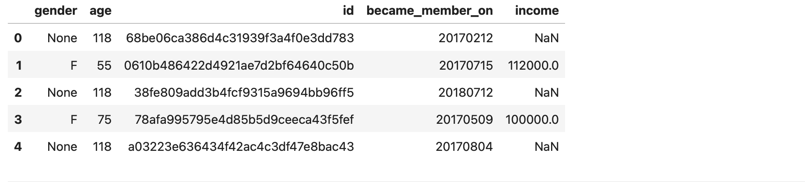

# Coffe or No Coffe ?

A case study of Starbucks customer engagement program for [Udacity Data Science Nanodegree](https://classroom.udacity.com/nanodegrees/nd025/dashboard/overview).  


Photo by <a href="https://unsplash.com/@guilhermestecanella?utm_source=unsplash&utm_medium=referral&utm_content=creditCopyText">Guilherme Stecanella</a> on <a href="https://unsplash.com/s/photos/starbucks?utm_source=unsplash&utm_medium=referral&utm_content=creditCopyText">Unsplash</a>
  
## Project overview

With over 30,000 cafes across the globe, Starbucks has become more than just a household name. From its iconic cups to the espresso inside them, Starbucks has catapulted from one coffee bean shop in Seattle to a sprawling coporate giant over the last 50 years. [Starbucks Isn’t a Coffee Business — It’s a Data Tech Company.](https://marker.medium.com/starbucks-isnt-a-coffee-company-its-a-data-technology-business-ddd9b397d83e) 

Starbucks often engages customers by sending them various offers, sometimes informational, sometimes it's a discount offer or Buy One Get One Free (BOGO). With its large customer base, how do we know which demographic groups respond best to which offer type? How do we know whether the offers actually improve company's bottom line?
 
These are the basis of this project. In the sections below, we're going to use techniques from data science to analyze customer's interactions with these offers, then use machine learning techniques to train a classifier to predict customer's reponses. 

## Problem Statement

From the three simulated datasets provided, we have 10 different offers and with varying level of responses from customers. There are many areas that we can explore. For this project, the question we are focusing is: given customers' demgraphic info, how do we predict whether she/he will respond to a particular offer? From the data science perspective, this is to build a binary classifer where the inputs are customer demographic and offer info. If the output is 0, customer is unlikely to respond to the offer versus 1 customer is most likely to respond.  

Without a question, a good predictive model like this will help Starbucks to identify the right group for an offer. It's not only going to reduce unwanted interactons with its customers, but also increases the effectivness of its loyalty programs.

To solve this task, let's start with data. We're going to follow CRISP-DM to examine, clean, process and understand these data. 

## Data Processing and Understanding

There are three datasets which simulates how people make purchasing decisions and how those decisions are influenced by ads or promotional offers. The data are contained in three files:

* portfolio.json - containing offer ids and meta data about each offer (duration, type, etc.)
* profile.json - containing demographic data for each customer
* transcript.json - containing records for transactions, offers received, offers viewed, and offers completed

Offers have different types. Some users might not receive any offer during certain weeks. Not all users receive the same offer, and that is the challenge to understand and process with this data set.

### Portfolio Dataset

A few records from original dataset:


Portfolio represents offers under study. Among these, 2 are informational offers, 4 are discounts offers and 4 are BOGOs. 


Different offers come with different reward. Two of the offers have the highest reward and there are also two offers have no reward. Information offers don't have any rewards.

    
#### Data Processing tasks

Besides standardization step to rename `id` column to `offer_id`, `channels` is a column that needs processing. Its values is a list type which we can separate then one-hot encode. As part of this, we'll add a column to calculate the total number of channels that an offer was sent to. 

The unit for `duration` is in hours. To make it easier to join data laster on with other datasets, we conver it into hours. 

Putting it all together, processed Portfolio data look like this:

<div>
<table border="1" class="dataframe">
  <thead>
    <tr style="text-align: right;">
      <th></th>
      <th>offer_reward</th>
      <th>difficulty</th>
      <th>duration</th>
      <th>offer_id</th>
      <th>email_ch</th>
      <th>num_channels</th>
      <th>social_ch</th>
      <th>web_ch</th>
      <th>mobile_ch</th>
      <th>bogo</th>
      <th>discount</th>
      <th>informational</th>
    </tr>
  </thead>
  <tbody>
    <tr>
      <th>0</th>
      <td>10</td>
      <td>10</td>
      <td>168</td>
      <td>ae264e3637204a6fb9bb56bc8210ddfd</td>
      <td>1</td>
      <td>3</td>
      <td>1</td>
      <td>0</td>
      <td>1</td>
      <td>1</td>
      <td>0</td>
      <td>0</td>
    </tr>
    <tr>
      <th>1</th>
      <td>10</td>
      <td>10</td>
      <td>120</td>
      <td>4d5c57ea9a6940dd891ad53e9dbe8da0</td>
      <td>1</td>
      <td>4</td>
      <td>1</td>
      <td>1</td>
      <td>1</td>
      <td>1</td>
      <td>0</td>
      <td>0</td>
    </tr>
  </tbody>
</table>
</div>

### Profile Dataset

A few records from the original dataset:



Profile provides demographic information for Starbucks' customer base, it tells the age, gender and income etc about the customers. We'll start with data processing step then look into deeper to understand who the customers are.

#### Data Processing

There were lot to do to get this dataset in order, here are some of the major steps, 

- Rename `id` column to customer_id and apply one-hot encoding to column `gender`. The null values will be dropped during cleaning step.
- The `age` column is the acutal age of the customers. For this project, the age group of the customer is more interesting.  We bucketize the age value into a group of 10s (e.g. age_10s, age_20s ... age_100s) then apply one-hot encoding to the newly created age_group columns.
- For the column `became_member_year`, we can build a feature to reveal whether a customer is new or long term. Since we don't know the start time of the study so we'll use current time to subtract data from `membership_length` for membership duration. In addtion, we extract `year` and `month` from this column to store information when customers became members, and finally apply one-hot encoding.
- Similarly to `age` column, the `income` buckets are more interesting. Her we group income group by 10k range. 
- The `gender` column is messy. There are 3 categories of gender: 'F', 'M', 'O' with some data missing. The processing is straight forward to use one-hot encoding. The missing data will be dropped. 

Within profile, there are a group of customers with age = 118, based on data inspection, the gender and income are missing for this group. We treat these as anomaly and drop them.

#### Combine all processing steps together, here is the process dataset.

<div>
<table border="1" class="dataframe">
  <thead>
    <tr style="text-align: right;">
      <th></th>
      <th>gender</th>
      <th>age</th>
      <th>customer_id</th>
      <th>became_member_on</th>
      <th>income</th>
      <th>became_member_on</th>
      <th>became_member_year</th>
      <th>became_member_month</th>
      <th>membership_length</th>
      <th>became_member_year_2013</th>
      <th>...</th>
      <th>income_40K</th>
      <th>income_50K</th>
      <th>income_60K</th>
      <th>income_70K</th>
      <th>income_80K</th>
      <th>income_90K</th>
      <th>income_100K</th>
      <th>income_110K</th>
      <th>income_120K</th>
      <th>income_130K</th>
    </tr>
  </thead>
  <tbody>
    <tr>
      <th>1</th>
      <td>F</td>
      <td>55</td>
      <td>0610b486422d4921ae7d2bf64640c50b</td>
      <td>20170715</td>
      <td>112000.0</td>
      <td>20170715</td>
      <td>2017</td>
      <td>7</td>
      <td>1514</td>
      <td>0</td>
      <td>...</td>
      <td>0</td>
      <td>0</td>
      <td>0</td>
      <td>0</td>
      <td>0</td>
      <td>0</td>
      <td>0</td>
      <td>1</td>
      <td>0</td>
      <td>0</td>
    </tr>
    <tr>
      <th>3</th>
      <td>F</td>
      <td>75</td>
      <td>78afa995795e4d85b5d9ceeca43f5fef</td>
      <td>20170509</td>
      <td>100000.0</td>
      <td>20170509</td>
      <td>2017</td>
      <td>5</td>
      <td>1581</td>
      <td>0</td>
      <td>...</td>
      <td>0</td>
      <td>0</td>
      <td>0</td>
      <td>0</td>
      <td>0</td>
      <td>0</td>
      <td>1</td>
      <td>0</td>
      <td>0</td>
      <td>0</td>
    </tr>
    <tr>
      <th>5</th>
      <td>M</td>
      <td>68</td>
      <td>e2127556f4f64592b11af22de27a7932</td>
      <td>20180426</td>
      <td>70000.0</td>
      <td>20180426</td>
      <td>2018</td>
      <td>4</td>
      <td>1229</td>
      <td>0</td>
      <td>...</td>
      <td>0</td>
      <td>0</td>
      <td>0</td>
      <td>1</td>
      <td>0</td>
      <td>0</td>
      <td>0</td>
      <td>0</td>
      <td>0</td>
      <td>0</td>
    </tr>
    <tr>
      <th>8</th>
      <td>M</td>
      <td>65</td>
      <td>389bc3fa690240e798340f5a15918d5c</td>
      <td>20180209</td>
      <td>53000.0</td>
      <td>20180209</td>
      <td>2018</td>
      <td>2</td>
      <td>1305</td>
      <td>0</td>
      <td>...</td>
      <td>0</td>
      <td>1</td>
      <td>0</td>
      <td>0</td>
      <td>0</td>
      <td>0</td>
      <td>0</td>
      <td>0</td>
      <td>0</td>
      <td>0</td>
    </tr>
    <tr>
      <th>12</th>
      <td>M</td>
      <td>58</td>
      <td>2eeac8d8feae4a8cad5a6af0499a211d</td>
      <td>20171111</td>
      <td>51000.0</td>
      <td>20171111</td>
      <td>2017</td>
      <td>11</td>
      <td>1395</td>
      <td>0</td>
      <td>...</td>
      <td>0</td>
      <td>1</td>
      <td>0</td>
      <td>0</td>
      <td>0</td>
      <td>0</td>
      <td>0</td>
      <td>0</td>
      <td>0</td>
      <td>0</td>
    </tr>
  </tbody>
</table>
<p>5 rows × 51 columns</p>
</div>

Columns for processed profile dataset:
```
Index(['gender', 'age', 'customer_id', 'income', 'became_member_year',
       'became_member_month', 'membership_length', 'became_member_year_2013',
       'became_member_year_2014', 'became_member_year_2015',
       'became_member_year_2016', 'became_member_year_2017',
       'became_member_year_2018', 'became_member_month_1',
       'became_member_month_2', 'became_member_month_3',
       'became_member_month_4', 'became_member_month_5',
       'became_member_month_6', 'became_member_month_7',
       'became_member_month_8', 'became_member_month_9',
       'became_member_month_10', 'became_member_month_11',
       'became_member_month_12', 'F', 'M', 'O', 'age_10s', 'age_20s',
       'age_30s', 'age_40s', 'age_50s', 'age_60s', 'age_70s', 'age_80s',
       'age_90s', 'age_100s', 'income_30K', 'income_40K', 'income_50K',
       'income_60K', 'income_70K', 'income_80K', 'income_90K', 'income_100K',
       'income_110K', 'income_120K', 'income_130K'],
      dtype='object')
```
#### Understanding Customers

- By age groups
   

    
Most costumers are between 40 and 80 years with age 50 as the biggest group. 

- By membership year


2017 was a lot of new members starting.

- Becoming a member by gender and year
  

  
Most customers started their membership in 2017 especially the male customers who exceeds the new female new members in that year as well as in year 2018.

- By income group


    
Most of customer are in the income buckets of 30k to 80k. There're fewer customers in the higher buckets above 100k. 

### Transcript

Transcript captures all activities and interations from customers.  A few rows for the raw data:


#### Data Processing

Following columns need to be examined and proceesed.

- `event` column mixes the type of **transaction**, with three offer activies: **offer received**, **offer viewed** and **offer completed**. We apply one-hot encoding for these.
- `person` column is actually customer id, we'll rename.
- `time` column is in hours. It's the time of each event since start of test. The data begins at time t=0.
- `value` is a dictionary of strings with keys such as 'reward', 'amount', 'offer id' and 'offer_id'. The keys for an offer activity are different than **transaction** event. The task is to separate the data into a set of columns. Make a seperate offer_id column accordingly.  

#### Cleaning

 - Removing the records of customers with age 118 since those are anomalous data.

Put it all together, our data will have this format.
<div>
<table border="1" class="dataframe">
  <thead>
    <tr style="text-align: right;">
      <th></th>
      <th>customer_id</th>
      <th>event</th>
      <th>time</th>
      <th>offer_id</th>
      <th>reward</th>
      <th>amount</th>
      <th>offer completed</th>
      <th>offer received</th>
      <th>offer viewed</th>
      <th>transaction</th>
    </tr>
  </thead>
  <tbody>
    <tr>
      <th>0</th>
      <td>78afa995795e4d85b5d9ceeca43f5fef</td>
      <td>offer received</td>
      <td>0</td>
      <td>9b98b8c7a33c4b65b9aebfe6a799e6d9</td>
      <td>0.0</td>
      <td>0.0</td>
      <td>0</td>
      <td>1</td>
      <td>0</td>
      <td>0</td>
    </tr>
    <tr>
      <th>1</th>
      <td>a03223e636434f42ac4c3df47e8bac43</td>
      <td>offer received</td>
      <td>0</td>
      <td>0b1e1539f2cc45b7b9fa7c272da2e1d7</td>
      <td>0.0</td>
      <td>0.0</td>
      <td>0</td>
      <td>1</td>
      <td>0</td>
      <td>0</td>
    </tr>
  </tbody>
</table>
</div>

### Create a new offer-response dataset

After we complete the initial data processing steps, now we are ready to leap forward to create a new dataset to capture how customers respond to an offer. The approach is to combine 3 dataset datasets with a joint dimension of customer and offer. 

The definition that an offer is responded is tricky. We can't depend on the **offer completed** event because a customer can complete an offer without receiving nor viewing offer. For informational offers, there is no **offer completed** event. We also can't just go by  **offer viewed** event because customer could take no action after that. After evaluating number of scenarios, that an offer is responded is defined as following:

1. For an information offer, it is reviewed and purcahse is made during offer period.
2. For a discount or bogo offer, it is considered as responded if there are "offer completed" events and purchase made during the offer period.

 To capture this, two compound columns were created, 
 
 - `purchase_during_offer` which we based on the offer period to filter transactions from customers. The offer period is defined in below.
 - `responded` which combines the **offer viewed** event with `purchase_during_offer`.

The offer period is the time between an offer is received until an offer passes its duration. If an offer is sent to customer once, this is straightforward to calculate. In our dataset, there are lot instances where the same offer has been sent to the customer multiple times. In that case, the offer starts with the first time when customer recieves it and ends when the last offer expires.

See **dataprocessing.offer-response** module for all the logic to create this new dataset. The offer-response dataset has ~63K samples with 68 different fields. See a few records: 

<div>
<table border="1" class="dataframe">
  <thead>
    <tr style="text-align: right;">
      <th></th>
      <th>customer_id</th>
      <th>offer_id</th>
      <th>offer_received_sum</th>
      <th>offer_viewed_sum</th>
      <th>offer_completed_sum</th>
      <th>offer_reward</th>
      <th>difficulty</th>
      <th>duration</th>
      <th>web_ch</th>
      <th>num_channels</th>
      <th>...</th>
      <th>income_40K</th>
      <th>income_50K</th>
      <th>income_60K</th>
      <th>income_70K</th>
      <th>income_80K</th>
      <th>income_90K</th>
      <th>income_100K</th>
      <th>income_110K</th>
      <th>income_120K</th>
      <th>income_130K</th>
    </tr>
  </thead>
  <tbody>
    <tr>
      <th>0</th>
      <td>0009655768c64bdeb2e877511632db8f</td>
      <td>2906b810c7d4411798c6938adc9daaa5</td>
      <td>1</td>
      <td>0</td>
      <td>1</td>
      <td>2</td>
      <td>10</td>
      <td>168</td>
      <td>1</td>
      <td>3</td>
      <td>...</td>
      <td>0.0</td>
      <td>0.0</td>
      <td>0.0</td>
      <td>1.0</td>
      <td>0.0</td>
      <td>0.0</td>
      <td>0.0</td>
      <td>0.0</td>
      <td>0.0</td>
      <td>0.0</td>
    </tr>
    <tr>
      <th>1</th>
      <td>0009655768c64bdeb2e877511632db8f</td>
      <td>3f207df678b143eea3cee63160fa8bed</td>
      <td>1</td>
      <td>1</td>
      <td>0</td>
      <td>0</td>
      <td>0</td>
      <td>96</td>
      <td>1</td>
      <td>3</td>
      <td>...</td>
      <td>0.0</td>
      <td>0.0</td>
      <td>0.0</td>
      <td>1.0</td>
      <td>0.0</td>
      <td>0.0</td>
      <td>0.0</td>
      <td>0.0</td>
      <td>0.0</td>
      <td>0.0</td>
    </tr>
    <tr>
      <th>2</th>
      <td>0009655768c64bdeb2e877511632db8f</td>
      <td>5a8bc65990b245e5a138643cd4eb9837</td>
      <td>1</td>
      <td>1</td>
      <td>0</td>
      <td>0</td>
      <td>0</td>
      <td>72</td>
      <td>0</td>
      <td>3</td>
      <td>...</td>
      <td>0.0</td>
      <td>0.0</td>
      <td>0.0</td>
      <td>1.0</td>
      <td>0.0</td>
      <td>0.0</td>
      <td>0.0</td>
      <td>0.0</td>
      <td>0.0</td>
      <td>0.0</td>
    </tr>
  </tbody>
</table>
</div>

As part of producing offer-response dataset, a summary dataset (response_summary) was created based on the new dataset.

### Data Exploration

Now, let's look at the new datasets to answer some of the business related questions.
 
1. How do customers respond the offers, e.g. what is the most popular offer?

Based on the information in offer summary, 

<div>
<table border="1" class="dataframe">
  <thead>
    <tr style="text-align: right;">
      <th></th>
      <th>offer_id</th>
      <th>count</th>
      <th>responded_count</th>
      <th>success_rate</th>
      <th>offer_type</th>
    </tr>
  </thead>
  <tbody>
    <tr>
      <th>9</th>
      <td>fafdcd668e3743c1bb461111dcafc2a4</td>
      <td>6332</td>
      <td>4433</td>
      <td>70.01</td>
      <td>discount</td>
    </tr>
    <tr>
      <th>1</th>
      <td>2298d6c36e964ae4a3e7e9706d1fb8c2</td>
      <td>6325</td>
      <td>4313</td>
      <td>68.19</td>
      <td>discount</td>
    </tr>
    <tr>
      <th>5</th>
      <td>5a8bc65990b245e5a138643cd4eb9837</td>
      <td>6320</td>
      <td>4002</td>
      <td>63.32</td>
      <td>informational</td>
    </tr>
    <tr>
      <th>8</th>
      <td>f19421c1d4aa40978ebb69ca19b0e20d</td>
      <td>6262</td>
      <td>3655</td>
      <td>58.37</td>
      <td>bogo</td>
    </tr>
    <tr>
      <th>4</th>
      <td>4d5c57ea9a6940dd891ad53e9dbe8da0</td>
      <td>6330</td>
      <td>2825</td>
      <td>44.63</td>
      <td>bogo</td>
    </tr>
    <tr>
      <th>7</th>
      <td>ae264e3637204a6fb9bb56bc8210ddfd</td>
      <td>6374</td>
      <td>2843</td>
      <td>44.60</td>
      <td>bogo</td>
    </tr>
    <tr>
      <th>3</th>
      <td>3f207df678b143eea3cee63160fa8bed</td>
      <td>6331</td>
      <td>2618</td>
      <td>41.35</td>
      <td>informational</td>
    </tr>
    <tr>
      <th>6</th>
      <td>9b98b8c7a33c4b65b9aebfe6a799e6d9</td>
      <td>6355</td>
      <td>2504</td>
      <td>39.40</td>
      <td>bogo</td>
    </tr>
    <tr>
      <th>2</th>
      <td>2906b810c7d4411798c6938adc9daaa5</td>
      <td>6285</td>
      <td>2415</td>
      <td>38.42</td>
      <td>discount</td>
    </tr>
    <tr>
      <th>0</th>
      <td>0b1e1539f2cc45b7b9fa7c272da2e1d7</td>
      <td>6374</td>
      <td>1472</td>
      <td>23.09</td>
      <td>discount</td>
    </tr>
  </tbody>
</table>
</div>


The most popular offer (fafdcd668e3743c1bb461111dcafc2a4) is a discount offer. More than 70% offer sent out were responded by customers. The least popular offer is also a discount offer(0b1e1539f2cc45b7b9fa7c272da2e1d7) which only 23% were responded. Both offers had the same duration, however the difficulty of the more popular one was a half of the other one which seemed to make the difference.


2. How do offer types affect response? Do customers view informational offers?

Based on data above, offer types affect respondence as well as the difficulty of these offers. For informational offer, customers not only viewed them, they also made purchases during the offer. 

<div>
<table border="1" class="dataframe">
  <thead>
    <tr style="text-align: right;">
      <th></th>
      <th>offer_id</th>
      <th>count</th>
      <th>responded_count</th>
      <th>success_rate</th>
      <th>offer_type</th>
    </tr>
  </thead>
  <tbody>
    <tr>
      <th>5</th>
      <td>5a8bc65990b245e5a138643cd4eb9837</td>
      <td>6320</td>
      <td>4002</td>
      <td>63.32</td>
      <td>informational</td>
    </tr>
    <tr>
      <th>3</th>
      <td>3f207df678b143eea3cee63160fa8bed</td>
      <td>6331</td>
      <td>2618</td>
      <td>41.35</td>
      <td>informational</td>
    </tr>
  </tbody>
</table>
</div>

3. What are the difference between male and femable customers of their interactions with the offers ?

Based on charts below, income wise, the minimum and maximum incomes for both male and female customers are similar with the number of male customers in low-income level is higher. The income distribution pattern for Others is similar to the males and females even though the minimum and maximum incomes are lower than the other two groups.


    
- From the chart below, Male customers were very active in terms of viewing the offer received.


    
- Male customers viewed lot of offers and responded more often to these offers than femable customers.

    
- Even though Male customers were more active than female customers in terms of offer activties, in terms of money spending, female customers spent more money during the offers!
    

    
When sending offers to different gender groups, we need to account for all these factors.

## Modeling the Offer Response

The classsifer of the offer response will generate an output based on the customer info and offer info. The model trains on the offer-response data generated from above data pipleline. In the following sections, we start with feature selection, algorithms, model evalation and then hyperparameter tuning.

### Feature selection

The offer_response dataset has 68 columns, and not all of them are useful for training. Specifically, we are going to drop following columns and remove all the nulls. These columns are either ids or the columns we have one-hot encoded.

```
'customer_id',
'offer_id',
'offer_received_sum',
'offer_viewed_sum',
'offer_completed_sum',
'age',
'became_member_on',
'became_member_year',
'became_member_month',
'income',
'gender',
```


### Create train and test datasets

Column `responded` is our label column, the rest goes to as input. We are going split data into .7 for training and .3 for test. To minimize the impact of large numbers, we are going to apply MaxScaler for following colummns 

 - 'difficulty', 'duration', 'offer_reward', 'membership_length' and 'purchase_during_offer'
 
After creating the train and test dataset, it is a good practice to check whether the data are balanced. The delta of values (0, 1) in training and test label sets are within 3%, we can conclude that our training/testing dataset is nearly balanced. 

For train dataset, 

    value stats:
    1    52.94
    0    47.06
    Name: responded, dtype: float64
    
    Values std: 2.9399999999999977, threshod: 10.
    Values for responded is balanced.

For test dataset, 


    value stats:
    1    53.33
    0    46.67
    Name: responded, dtype: float64
    
    Values std: 3.3299999999999983, threshod: 10.
    Values for responded is balanced.


### Training

It is important to select **evaluation metrics** before training starts. From above, our train/teset dataset are well balanced in terms of distribution of of labels. Evalaution metrics like precision, recall, and f1-score are suitable to use. 

- precision answers: what portion of postive identificaiton was actually correct?
- recall answers: what portion of active postive was identified correctly?
- F1-score represents "the harmonic mean of the precision and recall metrics".

In the training process below, we focus on using f1-score in conjunction with confusion matrix.

#### Choice of Classifers

There are many different type of classifers that we can choose from sklearn. We are going to try out three here: 

- RandomForestClassifier
- GradientBoostingClassifier
- AdaBoostClassifier 

and compare their performance.

For the first path, we are just going through all classifers without any addtional tuning to see how they fair.

```python
clf_names = []
clf_f1_scores = []
clf_best_models = []
clf_time_taken = []

for clf in offerm.CLASSIFER_LIST:

    model, f1_score, time_taken = offerm.train(clf, {}, X_train, y_train, scoring='f1', cv=5, verbose=0)
    clf_names.append(clf.__class__.__name__)
    clf_f1_scores.append(f1_score)
    clf_best_models.append(model)
    clf_time_taken.append(time_taken)
    
result_dict = {'best_f1_score': clf_f1_scores,  'time_taken(s)': clf_time_taken, "best_model": clf_best_models}
result_df = pd.DataFrame(result_dict, index=clf_names)
result_df
```

Output from running code above: 

<div>
<table border="1" class="dataframe">
  <thead>
    <tr style="text-align: right;">
      <th></th>
      <th>best_f1_score</th>
      <th>time_taken(s)</th>
      <th>best_model</th>
    </tr>
  </thead>
  <tbody>
    <tr>
      <th>RandomForestClassifier</th>
      <td>1.0</td>
      <td>8.20</td>
      <td>(DecisionTreeClassifier(max_features='auto', r...</td>
    </tr>
    <tr>
      <th>GradientBoostingClassifier</th>
      <td>1.0</td>
      <td>16.77</td>
      <td>([DecisionTreeRegressor(criterion='friedman_ms...</td>
    </tr>
    <tr>
      <th>AdaBoostClassifier</th>
      <td>1.0</td>
      <td>0.25</td>
      <td>(DecisionTreeClassifier(max_depth=1, random_st...</td>
    </tr>
  </tbody>
</table>
</div>

#### Observations

- All three classifers were achiving almost perfect f1_score(approx. 1.0) on its training dataset. How is this possible???  We are going to investigate this shortly. 
- Since all three classifier have almost identical performance. We're going to look at the confusion matrix from RandomForestClassifier for the test set.


```python
y_pred = randomforest_clf.predict(X_test)
conf_matrix = offerm.get_confusion_matrix(y_test, y_pred, normalized=True)
```
output:

```python
true postives: 8834, false postives: 0
true negatives: 7731, false negatives: 2
    
Normalized confusion matrix:
[[1.00000000e+00 0.00000000e+00]
[2.26346763e-04 9.99773653e-01]]
```

Even for the test dataset, the score was perfect!

#### So what just happened ?

A nearly perfect score is delightful however worrysome. Does this have anythig to do with the features that we use ? Charting the features on a diagram, 
    

    

`purchase_during_offer` showed up as the most dominiate feature. The second is the membership_length.  Other features had very little influence to the prediction. `purchase_during_offer` is a compound feature that we calculated based on the purchase that customer made during an offer period. If we had known a purchase made, we'd know almost for sure that customer repsonded and vice versa. In other words, we have a feature directly correlated to the training target. In this light, the classifer we trained is not truely `predictive`. We need to take this out and retrain.


### Training without knowing the purchase made
We're going to remove `purchase_during_offer` from our features and retrain the model. 


```python
cols_removal = [
    'customer_id',
    'offer_id',
    'offer_received_sum',
    'offer_viewed_sum',
    'offer_completed_sum',
    'age',
    'became_member_on',
    'became_member_year',
    'became_member_month',
    'income',
    'gender',
    'purchase_during_offer',
]

features_to_scale = ['difficulty', 'duration', 'offer_reward', 'membership_length']

X_train, X_test, y_train, y_test = offerfe.create_training_data(offer_response_df, label_col='responded', test_size=0.3, cols_removal=cols_removal, features_to_scale=features_to_scale)

new_clf_names = []
new_clf_f1_scores = []
new_clf_best_models = []
new_clf_time_taken = []

for clf in offerm.CLASSIFER_LIST:

    model, f1_score, time_taken = offerm.train(clf, {}, X_train, y_train, scoring='f1', cv=5, verbose=0)
    new_clf_names.append(clf.__class__.__name__)
    new_clf_f1_scores.append(f1_score)
    new_clf_best_models.append(model)
    new_clf_time_taken.append(time_taken)
```

Output: 


<div>

<table border="1" class="dataframe">
  <thead>
    <tr style="text-align: right;">
      <th></th>
      <th>best_f1_score</th>
      <th>time_taken(s)</th>
      <th>best_model</th>
    </tr>
  </thead>
  <tbody>
    <tr>
      <th>RandomForestClassifier</th>
      <td>0.670284</td>
      <td>17.92</td>
      <td>(DecisionTreeClassifier(max_features='auto', r...</td>
    </tr>
    <tr>
      <th>GradientBoostingClassifier</th>
      <td>0.709751</td>
      <td>23.91</td>
      <td>([DecisionTreeRegressor(criterion='friedman_ms...</td>
    </tr>
    <tr>
      <th>AdaBoostClassifier</th>
      <td>0.700313</td>
      <td>8.55</td>
      <td>(DecisionTreeClassifier(max_depth=1, random_st...</td>
    </tr>
  </tbody>
</table>
</div>


The f1 score for all three classifer is lower but all still reasonable. For all 3, GradientBoostingClassifier has the best performance. 

**Confusion Matrix** for GradientBoostingClassifier

```
true postives: 6255, false postives: 2507
true negatives: 5224, false negatives: 2581

Normalized confusion matrix:
[[0.67572112 0.32427888]
 [0.2921005  0.7078995 ]]
```

The results shows our model is able to identify 70% of cases that customer responded to an offer, 67% of cases that customer didn't respond to an offer. False Negatives is less than False positives, this means that Starbucks would less likely to miss sending offers to individuals who can respond and would still in balance of not sending offers to customers who would not respond. 

**Feature importance** output from GradientBoostingClassifier.

<div>

<table border="1" class="dataframe">
  <thead>
    <tr style="text-align: right;">
      <th></th>
      <th>feature</th>
      <th>imp_perc</th>
    </tr>
  </thead>
  <tbody>
    <tr>
      <th>0</th>
      <td>membership_length</td>
      <td>35.86</td>
    </tr>
    <tr>
      <th>1</th>
      <td>social_ch</td>
      <td>2.58</td>
    </tr>
    <tr>
      <th>2</th>
      <td>age_50s</td>
      <td>2.43</td>
    </tr>
    <tr>
      <th>3</th>
      <td>num_channels</td>
      <td>2.41</td>
    </tr>
    <tr>
      <th>4</th>
      <td>age_60s</td>
      <td>2.41</td>
    </tr>
    <tr>
      <th>5</th>
      <td>difficulty</td>
      <td>2.14</td>
    </tr>
    <tr>
      <th>6</th>
      <td>age_40s</td>
      <td>2.08</td>
    </tr>
    <tr>
      <th>7</th>
      <td>income_50K</td>
      <td>1.94</td>
    </tr>
    <tr>
      <th>8</th>
      <td>age_70s</td>
      <td>1.89</td>
    </tr>
    <tr>
      <th>9</th>
      <td>income_70K</td>
      <td>1.86</td>
    </tr>
  </tbody>
</table>
</div>

    

    

#### Observations
    
- Number one feature is the the length of the membership. The longer of being a member, it is more likely for she/he to respond. This intuitively makes sense.
- Offer broadcasted via 'social' channel is ranked as the second. This also makes sense due to greater media exposure.  
- num_channels is calculated and indicates the number of channels that the offer is visible. The higher number of channels, the more likely customers will see it and respond.
- Multiple age groups, 'age_40s', 'age_50s', 'age_60s' and 'age_70s' are on the list. This indicates age of the customer should be carefully looked at when sending an offer.    
- income_50K and 'income_70K' features, which represent if customer's income is in bucket of 50k or 70K. These may be significant groups for engagement. 

### Hyperparameter Tuning

GridSearch will be used to look for best GradientBoostingClassifier with a set of parameters.

First two helper functions.

```python
def get_f1_score(grid, param_name):
    """Get f1_score from GridSearchCV 
    
    Args:
        a fitted grid
        
    Returns:
        None
    """
                                             
    clf = grid.best_estimator_
    y_pred = clf.predict(X_test)
    test_f1_score = f1_score(y_test, y_pred)
    print(f'Grid search result: best {param_name} = {grid.best_params_}, best training_score = {grid.best_score_}, f1_score: {test_f1_score}')
```


```python
def get_scores(param_name):
    """Get test scores from GridSearchCV
    Args:
        hyperparam_key: name of the hyperparameter from GridSearchCV cv_results_
        
    Returns:
        A panda dataframe with test scores.
    
    """
    cols = [f'param_{param_name}', 'mean_test_score', 'std_test_score']
    result_df = pd.DataFrame(columns=cols)
    for col in cols:
        result_df[col] = grid.cv_results_[col]
    return result_df    
```

**n_estimators**

n_estimators represents the number of trees in the forest. Usually the larger the number, the bette model learns the data. However, adding a lot of estimators can slow down the training process considerably without benefit of performance.


```python
params = {'n_estimators':range(4,33,4)}
grid = GridSearchCV(estimator = GradientBoostingClassifier(learning_rate=0.01, random_state=42), param_grid = params, scoring='f1',n_jobs=4, cv=5, return_train_score=True)  
grid.fit(X_train,y_train);
```


```python
param_name = list(params.keys())[0]
get_f1_score(grid, param_name)
get_scores('n_estimators')
```

    Grid search result: best n_estimators = {'n_estimators': 28}, best training_score = 0.7182956315413115, f1_score: 0.7199444058373871


<div>
<style scoped>
    .dataframe tbody tr th:only-of-type {
        vertical-align: middle;
    }

    .dataframe tbody tr th {
        vertical-align: top;
    }

    .dataframe thead th {
        text-align: right;
    }
</style>
<table border="1" class="dataframe">
  <thead>
    <tr style="text-align: right;">
      <th></th>
      <th>param_n_estimators</th>
      <th>mean_test_score</th>
      <th>std_test_score</th>
    </tr>
  </thead>
  <tbody>
    <tr>
      <th>0</th>
      <td>4</td>
      <td>0.692321</td>
      <td>0.000000</td>
    </tr>
    <tr>
      <th>1</th>
      <td>8</td>
      <td>0.692321</td>
      <td>0.000000</td>
    </tr>
    <tr>
      <th>2</th>
      <td>12</td>
      <td>0.703037</td>
      <td>0.000505</td>
    </tr>
    <tr>
      <th>3</th>
      <td>16</td>
      <td>0.712773</td>
      <td>0.001534</td>
    </tr>
    <tr>
      <th>4</th>
      <td>20</td>
      <td>0.712238</td>
      <td>0.003582</td>
    </tr>
    <tr>
      <th>5</th>
      <td>24</td>
      <td>0.715227</td>
      <td>0.006476</td>
    </tr>
    <tr>
      <th>6</th>
      <td>28</td>
      <td>0.718296</td>
      <td>0.003929</td>
    </tr>
    <tr>
      <th>7</th>
      <td>32</td>
      <td>0.715927</td>
      <td>0.005731</td>
    </tr>
  </tbody>
</table>
</div>


n_estimators as 28 has the best score.

**max_depth**

max_depth represents the depth of each tree in the forest. The deeper the tree, the more splits it has and it captures more information about the data. 


```python
param_name = 'max_depth'
max_depths = range(5,16,2)
params = {param_name:max_depths}

grid = GridSearchCV(estimator = GradientBoostingClassifier(learning_rate=0.01, n_estimators=28, random_state=42), param_grid = params, scoring='f1',n_jobs=4, cv=5, return_train_score=True)  
grid.fit(X_train,y_train);
```


```python
get_f1_score(grid, param_name)
get_scores(param_name)
```
    Grid search result: best max_depth = {'max_depth': 7}, best training_score = 0.7269588475386956, f1_score: 0.7326290125965056


<div>
<style scoped>
    .dataframe tbody tr th:only-of-type {
        vertical-align: middle;
    }

    .dataframe tbody tr th {
        vertical-align: top;
    }

    .dataframe thead th {
        text-align: right;
    }
</style>
<table border="1" class="dataframe">
  <thead>
    <tr style="text-align: right;">
      <th></th>
      <th>param_max_depth</th>
      <th>mean_test_score</th>
      <th>std_test_score</th>
    </tr>
  </thead>
  <tbody>
    <tr>
      <th>0</th>
      <td>5</td>
      <td>0.720968</td>
      <td>0.001518</td>
    </tr>
    <tr>
      <th>1</th>
      <td>7</td>
      <td>0.726959</td>
      <td>0.002143</td>
    </tr>
    <tr>
      <th>2</th>
      <td>9</td>
      <td>0.722594</td>
      <td>0.003338</td>
    </tr>
    <tr>
      <th>3</th>
      <td>11</td>
      <td>0.716878</td>
      <td>0.004319</td>
    </tr>
    <tr>
      <th>4</th>
      <td>13</td>
      <td>0.708853</td>
      <td>0.003207</td>
    </tr>
    <tr>
      <th>5</th>
      <td>15</td>
      <td>0.701408</td>
      <td>0.002438</td>
    </tr>
  </tbody>
</table>
</div>


max_depth as 7 is the optimal value.

**min_samples_leaf**

min_samples_leaf is The minimum number of samples required to be at a leaf node. This parameter is similar to min_samples_splits, however, this describe the minimum number of samples of samples at the leafs, the base of the tree.


```python
min_samples_leafs = range(10,31,5)
param_name = 'min_samples_leaf'
params = {param_name:min_samples_leafs}

grid = GridSearchCV(estimator = GradientBoostingClassifier(learning_rate=0.01, n_estimators=28, max_depth=7, random_state=42), param_grid = params, scoring='f1',n_jobs=4, cv=5, return_train_score=True)  
grid.fit(X_train,y_train);
```


```python
get_f1_score(grid, param_name)
get_scores(param_name)
```
    Grid search result: best min_samples_leaf = {'min_samples_leaf': 25}, best training_score = 0.7274949155769966, f1_score: 0.7327887981330221


<div>
<style scoped>
    .dataframe tbody tr th:only-of-type {
        vertical-align: middle;
    }

    .dataframe tbody tr th {
        vertical-align: top;
    }

    .dataframe thead th {
        text-align: right;
    }
</style>
<table border="1" class="dataframe">
  <thead>
    <tr style="text-align: right;">
      <th></th>
      <th>param_min_samples_leaf</th>
      <th>mean_test_score</th>
      <th>std_test_score</th>
    </tr>
  </thead>
  <tbody>
    <tr>
      <th>0</th>
      <td>10</td>
      <td>0.726926</td>
      <td>0.001793</td>
    </tr>
    <tr>
      <th>1</th>
      <td>15</td>
      <td>0.727335</td>
      <td>0.002657</td>
    </tr>
    <tr>
      <th>2</th>
      <td>20</td>
      <td>0.727284</td>
      <td>0.002135</td>
    </tr>
    <tr>
      <th>3</th>
      <td>25</td>
      <td>0.727495</td>
      <td>0.001850</td>
    </tr>
    <tr>
      <th>4</th>
      <td>30</td>
      <td>0.725879</td>
      <td>0.002118</td>
    </tr>
  </tbody>
</table>
</div>


Optimal min_samples_leaf is 25. 

**max_features**

max_features represents the number of features to consider when looking for the best split.


```python
max_features = list(range(1,X_train.shape[1], 4))
param_name = 'max_features'
params = {param_name:max_features}

grid = GridSearchCV(estimator = GradientBoostingClassifier(learning_rate=0.01, n_estimators=28, max_depth=7, min_samples_leaf=25, random_state=42), param_grid = params, scoring='f1',n_jobs=4, cv=5, return_train_score=True)  
grid.fit(X_train,y_train);
```


```python
get_f1_score(grid, param_name)
get_scores(param_name)
```

    Grid search result: best max_features = {'max_features': 45}, best training_score = 0.7284238685220747, f1_score: 0.7310365978327539

<div>
<style scoped>
    .dataframe tbody tr th:only-of-type {
        vertical-align: middle;
    }

    .dataframe tbody tr th {
        vertical-align: top;
    }

    .dataframe thead th {
        text-align: right;
    }
</style>
<table border="1" class="dataframe">
  <thead>
    <tr style="text-align: right;">
      <th></th>
      <th>param_max_features</th>
      <th>mean_test_score</th>
      <th>std_test_score</th>
    </tr>
  </thead>
  <tbody>
    <tr>
      <th>0</th>
      <td>1</td>
      <td>0.705190</td>
      <td>0.001194</td>
    </tr>
    <tr>
      <th>1</th>
      <td>5</td>
      <td>0.726174</td>
      <td>0.003428</td>
    </tr>
    <tr>
      <th>2</th>
      <td>9</td>
      <td>0.727890</td>
      <td>0.003311</td>
    </tr>
    <tr>
      <th>3</th>
      <td>13</td>
      <td>0.726425</td>
      <td>0.001543</td>
    </tr>
    <tr>
      <th>4</th>
      <td>17</td>
      <td>0.726398</td>
      <td>0.001698</td>
    </tr>
    <tr>
      <th>5</th>
      <td>21</td>
      <td>0.727720</td>
      <td>0.001264</td>
    </tr>
    <tr>
      <th>6</th>
      <td>25</td>
      <td>0.727444</td>
      <td>0.002583</td>
    </tr>
    <tr>
      <th>7</th>
      <td>29</td>
      <td>0.727796</td>
      <td>0.001806</td>
    </tr>
    <tr>
      <th>8</th>
      <td>33</td>
      <td>0.727929</td>
      <td>0.002502</td>
    </tr>
    <tr>
      <th>9</th>
      <td>37</td>
      <td>0.727600</td>
      <td>0.002241</td>
    </tr>
    <tr>
      <th>10</th>
      <td>41</td>
      <td>0.727379</td>
      <td>0.000898</td>
    </tr>
    <tr>
      <th>11</th>
      <td>45</td>
      <td>0.728424</td>
      <td>0.001426</td>
    </tr>
    <tr>
      <th>12</th>
      <td>49</td>
      <td>0.727837</td>
      <td>0.002277</td>
    </tr>
    <tr>
      <th>13</th>
      <td>53</td>
      <td>0.727562</td>
      <td>0.001136</td>
    </tr>
  </tbody>
</table>
</div>


**Final model**

```
GradientBoostingClassifier(learning_rate=0.01, max_depth=7, max_features=45,
                           min_samples_leaf=25, n_estimators=28,
                           random_state=42)
```

confusion matrix:

```python
true postives: 7151, false postives: 3577
true negatives: 4154, false negatives: 1685

Normalized confusion matrix:
[[0.53731729 0.46268271]
 [0.19069715 0.80930285]]
```

With all the hyperparameter tuning, we're able to improve f1_score from 0.709751 to 0.7310365978327539.


## Conclusion

This project is an interesting and challenging journey. I had a chance to apply a lot learned from the nanodegree course (CRISP-DM, anyone ?) to handle the data processsing and business understanding. The part of reading all the sklearn classifiers' documentation and try them out was fine and fun. Coming from a software development backgroud, I thought writing the data processing should be easy peasy. It turned out that the proper data processsing and feature extraction is actually hard. The difficulties were not because of the python syntax nor the modules. It was because the number of times that I had to go back and force to decide when and where to combine columms in order to create a good dataset to support model training. Looking back, some of the design principles from software development such as thinking and creating entities, iterating through the usercase early with data given could pave a smoothier path for data processing pipelines. The iteration of two version of the model was also a good lesson for selecting feature careflly. At the end, seeing the change made by hyperparameter tuning was exciting. With all this said, the classifier trained is far from being perfect. Here are a few areas for futher improvements, 

- Include customer_id as part of input features. Consider lot of Starbucks customers are regular customer, adding this can help boost model accuracy. Even though `customer_id` is a str type, we can apply the Hashed Feature design pattern for encoding. More info about this design pattern can be found at [Machine Learning Design Patterns](https://learning.oreilly.com/library/view/machine-learning-design/9781098115777/ch02.html#problem-id00001). 

- Add more features by collect additional data related customer demographic info for example, the region where customer lives.

- Collect data differently. With current data collection, associating the transactions with offers is error prone because we rely on the offer period. One idea is to add functionality that a customer can order directly from the offer as a way to link transctions with offers.

Last, I'd like to thank all the instructors, project mentors and reviewers for the quality lessons and your valuable feedback.  

## Reference

 - [Complete Machine Learning Guide to Parameter Tuning in Gradient Boosting (GBM) in Python](https://www.analyticsvidhya.com/blog/2016/02/complete-guide-parameter-tuning-gradient-boosting-gbm-python/)
 - [In Depth: Parameter tuning for Random Forest](https://medium.com/all-things-ai/in-depth-parameter-tuning-for-random-forest-d67bb7e920d).

## Acknowledgements

The dataset used in this project contains simulated data from Starbucks rewards program. The data were made available via [Udacity Data Science Nanodegree](https://classroom.udacity.com/nanodegrees/nd025/dashboard/overview). 
